Analysis of Bacteria Levels at Casco Bay Beaches
================
Curtis C. Bohlen, Casco Bay Estuary Partnership.
01/23/2021

-   [Introduction](#introduction)
    -   [Standards](#standards)
        -   [Beaces Program](#beaces-program)
        -   [Maine State Class SB Waters
            Standards](#maine-state-class-sb-waters-standards)
-   [Import Libraries](#import-libraries)
-   [Data Preparation](#data-preparation)
    -   [Initial Folder References](#initial-folder-references)
    -   [Load Data](#load-data)
    -   [Add a “Beach” Identifier](#add-a-beach-identifier)
    -   [Add a “Day of the Week”
        Identifier](#add-a-day-of-the-week-identifier)
    -   [Normal and Conditional
        Samples](#normal-and-conditional-samples)
        -   [Results](#results)
        -   [Add The Indicator](#add-the-indicator)
    -   [Add Maximum Likelihood Estimate for
        Non-detects](#add-maximum-likelihood-estimate-for-non-detects)
    -   [Calculate Exceedences](#calculate-exceedences)
-   [Preliminary Graphics](#preliminary-graphics)
    -   [Histograms](#histograms)
    -   [Pareto distribution?](#pareto-distribution)
    -   [Temporal Plots](#temporal-plots)
    -   [Annual Frequency of
        Exceedences](#annual-frequency-of-exceedences)
-   [Recent Status](#recent-status)
    -   [Analysis of Bacteria MPN Data](#analysis-of-bacteria-mpn-data)
        -   [Distributions](#distributions)
        -   [Simple Log Linear Model](#simple-log-linear-model)
        -   [GLM Analysis](#glm-analysis)
        -   [Non-parametric Tests](#non-parametric-tests)
        -   [Conclusions](#conclusions)
    -   [Analyzing Exceedences of
        Standards](#analyzing-exceedences-of-standards)
        -   [Binomial Model](#binomial-model)
-   [Trend Analysis](#trend-analysis)
    -   [Initial Graphic](#initial-graphic)
    -   [Restricted Data](#restricted-data)
    -   [Thiel-Sen Slopes
        (unsuccessful)](#thiel-sen-slopes-unsuccessful)
    -   [Log Linear Model](#log-linear-model)
    -   [Gamma GLM](#gamma-glm-1)
    -   [Binomial GLM](#binomial-glm)
    -   [Conclusions](#conclusions-1)


# Introduction

To be added….

## Standards

### Beaces Program

104 CFU / 100 ml, for individual observations.

### Maine State Class SB Waters Standards

> the number of enterococcus bacteria in these waters may not exceed a
> geometric mean of 8 CFU per 100 milliliters in any 90-day interval or
> 54 CFU per 100 milliliters in more than 10% of the samples in any
> 90-day interval.

38 M.R.S. §465-B(2)(B)

# Import Libraries

``` r
library(fitdistrplus)  # Loads MASS, which has `select()`, so load first
#> Loading required package: MASS
#> Loading required package: survival
library(tidyverse)     # Loads another `select()`
#> Warning: package 'tidyverse' was built under R version 4.0.5
#> -- Attaching packages --------------------------------------- tidyverse 1.3.1 --
#> v ggplot2 3.3.3     v purrr   0.3.4
#> v tibble  3.1.2     v dplyr   1.0.6
#> v tidyr   1.1.3     v stringr 1.4.0
#> v readr   1.4.0     v forcats 0.5.1
#> Warning: package 'tidyr' was built under R version 4.0.5
#> Warning: package 'dplyr' was built under R version 4.0.5
#> Warning: package 'forcats' was built under R version 4.0.5
#> -- Conflicts ------------------------------------------ tidyverse_conflicts() --
#> x dplyr::filter() masks stats::filter()
#> x dplyr::lag()    masks stats::lag()
#> x dplyr::select() masks MASS::select()

library(emmeans)   # For marginal means

library(mblm)      # for the Thiel-Sen estimators -- not really successful here

library(VGAM)
#> Loading required package: stats4
#> Loading required package: splines
#> 
#> Attaching package: 'VGAM'
#> The following object is masked from 'package:tidyr':
#> 
#>     fill

library(CBEPgraphics)
load_cbep_fonts()
theme_set(theme_cbep())

library(LCensMeans)
```

# Data Preparation

## Initial Folder References

``` r
sibfldnm    <- 'Derived_Data'
parent      <- dirname(getwd())
sibling     <- file.path(parent,sibfldnm)

#dir.create(file.path(getwd(), 'figures'), showWarnings = FALSE)
#dir.create(file.path(getwd(), 'models'),  showWarnings = FALSE)
```

## Load Data

``` r
fn <- "beaches_data.csv"
beach_data <- read_csv(file.path(sibling, fn))
#> 
#> -- Column specification --------------------------------------------------------
#> cols(
#>   .default = col_double(),
#>   SiteCode = col_character(),
#>   sdatetime = col_datetime(format = ""),
#>   sdate = col_date(format = ""),
#>   Sample_ID = col_character(),
#>   Sample_Qualifier = col_character(),
#>   Lab_Qualifier = col_character(),
#>   Censored_Flag = col_logical(),
#>   Weather = col_character(),
#>   Past24HR_Weather = col_character(),
#>   Past48HR_Weather = col_character(),
#>   Tide_Stage = col_logical(),
#>   Water_Surface = col_character(),
#>   Current = col_logical()
#> )
#> i Use `spec()` for the full column specifications.
```

``` r
names(beach_data)
#>  [1] "SiteCode"         "sdatetime"        "sdate"            "Year"            
#>  [5] "Month"            "DOY"              "Sample_ID"        "Sample_Qualifier"
#>  [9] "Enterococci"      "Reporting_Limit"  "Lab_Qualifier"    "Bacteria"        
#> [13] "Censored_Flag"    "Rain24"           "Rain48"           "Salinity"        
#> [17] "Air_Temp"         "Water_Temp"       "Weather"          "Past24HR_Weather"
#> [21] "Past48HR_Weather" "Tide_Stage"       "Water_Surface"    "Current"
```

## Add a “Beach” Identifier

``` r
fn = "beach_locations.csv"
beach_lookup = read_csv(file.path(sibling, fn),
                        col_types = cols(
                          Town = col_character(),
                          Beach_Name = col_character(),
                          SamplePoint = col_character(),
                          Latitude = col_double(),
                          Longitude = col_double()
                        )) %>%
  select(-Latitude, -Longitude)

beach_data <- beach_data %>%
  mutate(Beach = beach_lookup$Beach_Name[match(SiteCode, 
                                               beach_lookup$SamplePoint)])
```

## Add a “Day of the Week” Identifier

We need this to help evaluate whether samples are “normal” samples or
“storm” samples.

``` r
beach_data <- beach_data %>%
  mutate(Weekday = weekdays(sdate)) %>%
  relocate(Weekday, .after = Month)
```

## Normal and Conditional Samples

The Beaches program principally collects samples from each beach on
specific days of the week. Samples collected on other days may be
“non-standard” samples. For example, protocol after a beach closure is
to test a few days later to see if levels of bacteria have returned to
safe levels. We should not expect such conditional samples to have the
same distribution of bacteria levels as normal samples.

Unfortunately, records are not entirely reliable on this matter, so the
best we can do is figure out if samples were collected on a “normal” day
of the week.

We look at Crosstabs by year to figure out the pattern.

``` r
dow <- xtabs(~Year + Weekday + Beach , data = beach_data)
dow
#> , , Beach = Broad Cove Reserve
#> 
#>       Weekday
#> Year   Friday Monday Saturday Sunday Thursday Tuesday Wednesday
#>   2000      0      0        0      0        0       0         0
#>   2001      0      0        0      0        0       0         0
#>   2002      0      0        0      0        0       0         0
#>   2003      0      0        0      0        0       0         0
#>   2004      0      0        0      0        0       0         0
#>   2005      0      0        0      0        0       0         0
#>   2006      0      0        0      0        0       0         0
#>   2007      0      0        0      0        0       0         0
#>   2008      0      0        0      0        0       0         0
#>   2009      0      0        0      0        0       0         0
#>   2010      0      0        0      0        0       0         0
#>   2011      0      0        0      0        0       0         0
#>   2012      0      0        0      0        0       0         0
#>   2013      0      0        0      0        0       0         0
#>   2014      0      0        0      0        0       0         0
#>   2015      0      0        0      0        0       0         0
#>   2016      0      0        0      0        0       0        14
#>   2017      0      0        0      0        1       0        11
#>   2018      0      0        0      0        1       0        11
#>   2019      0      0        0      0        0       0        13
#> 
#> , , Beach = East End Beach
#> 
#>       Weekday
#> Year   Friday Monday Saturday Sunday Thursday Tuesday Wednesday
#>   2000     13     13        0      0        1       0        14
#>   2001     12     13        0      0        1       0        12
#>   2002     14     14        0      0        0       0        14
#>   2003     13     13        0      0        0       1        14
#>   2004     13     12        0      0        2       3        14
#>   2005     12     12        0      0        0       2        13
#>   2006     13     11        1      1        2       3        13
#>   2007     13     12        0      0        3       1        12
#>   2008     12     13        0      0        0       1        13
#>   2009     14     14        0      0        0       0        14
#>   2010     17     15        0      0        5       3        17
#>   2011     13     14        0      0        1       0        12
#>   2012     15     13        1      1        1       0        14
#>   2013     13     14        1      0        1       0        13
#>   2014     13     12        0      0        3       0        14
#>   2015     13     14        0      0        0       0        13
#>   2016      0      0        0      0       13      13         0
#>   2017      0      0        0      0       12      12         0
#>   2018      1      0        0      0       14      11         0
#>   2019      0      0        0      0       12      13         2
#> 
#> , , Beach = Mackerel Cove
#> 
#>       Weekday
#> Year   Friday Monday Saturday Sunday Thursday Tuesday Wednesday
#>   2000      0      0        0      0        0       0         0
#>   2001      0      0        0      0        0       0         0
#>   2002      0      0        0      0        0       0         0
#>   2003      0      0        0      0        0       0         0
#>   2004      0      0        0      0        0       0         0
#>   2005      0      0        0      0        0       0         0
#>   2006      0      0        0      0        0       0         0
#>   2007      0      0        0      0        0       0         0
#>   2008      0      0        0      0        0       0         0
#>   2009      0      0        0      0        0       0         0
#>   2010      0      0        0      0        0       0         0
#>   2011      0      0        0      0        0       0         0
#>   2012      0      0        0      0        0       0         0
#>   2013      0      0        0      0        0       0         0
#>   2014      0      0        0      0        0       0         0
#>   2015      0      0        0      0        0       0         0
#>   2016      0      0        0      0        0       0         0
#>   2017      0      0        0      0        0       0         0
#>   2018      0      5        0      0        1       0         7
#>   2019      0     13        0      0        0       0         0
#> 
#> , , Beach = Mitchell Field Beach
#> 
#>       Weekday
#> Year   Friday Monday Saturday Sunday Thursday Tuesday Wednesday
#>   2000      0      0        0      0        0       0         0
#>   2001      0      0        0      0        0       0         0
#>   2002      0      0        0      0        0       0         0
#>   2003      0      0        0      0        0       0         0
#>   2004      0      0        0      0        0       0         0
#>   2005      0      0        0      0        0       0         0
#>   2006      0      0        0      0        0       0         0
#>   2007      0      0        0      0        0       0         0
#>   2008      0      0        0      0        0       0         0
#>   2009      0      0        0      0        0       0         0
#>   2010      0      0        0      0        0       0         0
#>   2011      0      0        0      0        0       0         0
#>   2012      0      0        0      0        0       0         0
#>   2013      0      0        0      0        0       0         0
#>   2014      0      0        0      0        0       0         0
#>   2015      0      0        0      0        0       0         0
#>   2016      0      0        0      0        0       0         0
#>   2017      0      0        0      0        0       0         0
#>   2018      0      5        0      0        1       0         6
#>   2019      0     13        0      0        0       0         1
#> 
#> , , Beach = Stovers Point Preserve
#> 
#>       Weekday
#> Year   Friday Monday Saturday Sunday Thursday Tuesday Wednesday
#>   2000      0      0        0      0        0       0         0
#>   2001      0      0        0      0        0       0         0
#>   2002      0      0        0      0        0       0         0
#>   2003      0      0        0      0        0       0         0
#>   2004      0      0        0      0        0       0         0
#>   2005      0      0        0      0        0       0         0
#>   2006      0      0        0      0        0       0         0
#>   2007      0      0        0      0        0       0         0
#>   2008      0      0        0      0        0       0         0
#>   2009      0      0        0      0        0       0         0
#>   2010      0      0        0      0        0       0         0
#>   2011      0      0        0      0        0       0         0
#>   2012      0      0        0      0        0       0         0
#>   2013      0      0        0      0        0       0         0
#>   2014      0      0        0      0        0       0         0
#>   2015      0      0        0      0        0       0         0
#>   2016      0      0        0      0        0       0         0
#>   2017      0      0        0      0        0       0         0
#>   2018      0      5        0      0        1       0         6
#>   2019      0     13        0      0        0       0         0
#> 
#> , , Beach = Willard Beach
#> 
#>       Weekday
#> Year   Friday Monday Saturday Sunday Thursday Tuesday Wednesday
#>   2000      0      0        0      0        0       0         0
#>   2001      0      0        0      0        0       0         0
#>   2002      0      0        0      0        0       0         0
#>   2003      0     36        0      0        0       1        34
#>   2004      0     39        0      0       12       9        41
#>   2005      3     39        0      0       15      10        45
#>   2006      1     39        0      0        6      15        36
#>   2007      1     36        0      0        9       3        35
#>   2008      0     39        0      0        3       9        39
#>   2009      0     36        0      0       12       6        36
#>   2010      0     33        0      0       10      12        39
#>   2011      0      0        0      0        0       0         0
#>   2012      0      2        0      0        0       0         3
#>   2013      0     13        0      0        1       1        14
#>   2014      0     12        0      0        1       0        14
#>   2015      0     14        0      0        2       2        12
#>   2016      0     12        0      0        1       1        14
#>   2017      0     12        0      0        0       0        13
#>   2018      0     13        0      0        1       0        12
#>   2019      0     13        0      0        0       0        13
#> 
#> , , Beach = Winslow Park
#> 
#>       Weekday
#> Year   Friday Monday Saturday Sunday Thursday Tuesday Wednesday
#>   2000      0      0        0      0        0       0         0
#>   2001      0      0        0      0        0       0         0
#>   2002      0      0        0      0        0       0         0
#>   2003      0      0        0      0        0       0         0
#>   2004      0      0        0      0        0       0         0
#>   2005      0      0        0      0        0       0         0
#>   2006      0      0        0      0        0       0         0
#>   2007      0      0        0      0        0       0         0
#>   2008      0      7        0      0        0       0         0
#>   2009      0      7        0      0        0       0         0
#>   2010      0      4        0      0        3       0         1
#>   2011      0      3        0      0        3       0         0
#>   2012      0      5        0      0        0       0         1
#>   2013      0      5        0      0        0       0         1
#>   2014      0      6        0      0        0       0         0
#>   2015      0      6        0      0        0       0         0
#>   2016      0      0        0      0        0       0         0
#>   2017      0      0        0      0        0       0         0
#>   2018      0      0        0      0        0       0         0
#>   2019      0      0        0      0        0       0         0
```

### Results

| Beach                    | Years          | Principal Days of the Week |
|--------------------------|----------------|----------------------------|
| Broad Cove Reserve       | 2016 - Present | Wednesday                  |
| East End Beach (to 2015) | 2000 - 2015    | Monday, Wednesday, Friday  |
| East End Beach (Recent)  | 2016 - Present | Tuesday, Thursday          |
| Mackerel Cove            | 2018           | Monday, Wednesday (?)      |
| Mackerel Cove            | 2019           | Monday                     |
| Mitchell Field Beach     | 2018           | Monday, Wednesday (?)      |
| Mitchell Field Beach     | 2019           | Monday                     |
| Stover’s Point Preserve  | 2018           | Monday, Wednesday (?)      |
| Stover’s Point Preserve  | 2019           | Monday                     |
| Willard Beach            | 2003 - 2010    | Monday, Wednesday (?)      |
| Willard Beach            | 2013 - Present | Monday, Wednesday          |
| Winslow Park             | 2008 - 2009    | Monday                     |
| Winslow Park             | 2010 - 2011    | Monday, Thursday           |
| Winslow Park             | 2012 - 2013    | Monday, Wednesday (?)      |
| Winslow Park             | 2014 - 2015    | Monday                     |

### Add The Indicator

We create a `FALSE` variable, and then go through site by site, flipping
the value to `TRUE` when appropriate. This code may not be appropriate
for future data sets, as it is tailored to the exceptions in the current
record.

``` r
beach_data <- beach_data %>%
  mutate(normal_flag = FALSE,
         normal_flag = if_else(Beach == 'Broad Cove Reserve' & 
                                Weekday == 'Wednesday',
                                TRUE, normal_flag),
         normal_flag = if_else(Beach == 'East End Beach' & 
                                Year < 2016 &
                                Weekday %in% c('Monday', 'Wednesday', 'Friday'),
                                TRUE, normal_flag),
         normal_flag = if_else(Beach == 'East End Beach' & 
                                Year >= 2016 &
                                Weekday %in% c('Tuesday', 'Thursday'),
                                TRUE, normal_flag),
          # The only "extras" at Mackerel Cove are on Thursday
         normal_flag = if_else(Beach == 'Mackerel Cove' & 
                                Weekday !=  'Thursday',   
                                TRUE, normal_flag),
          # At Mitchell Field, we just pick out the two "extras"
         normal_flag = if_else(Beach == 'Mitchell Field Beach' & 
                               (Year == 2018 & Weekday !=  'Thursday') |  
                                 (Year == 2019 & Weekday != 'Wednesday'),
                                TRUE, normal_flag),
        # The only "extras" at Stover's Point are on Thursday
         normal_flag = if_else(Beach == 'Stovers Point Preserve' & 
                                Weekday !=  'Thursday',   
                                TRUE, normal_flag),
         normal_flag = if_else(Beach == 'Willard Beach' & 
                               Weekday %in% c('Monday', 'Wednesday'),
                                TRUE, normal_flag),
        # At Winslow, it's not clear if any of the samples were exceptional
        # samples, so we treat them all as regular samples.
         normal_flag = if_else(Beach == 'Winslow Park', 
                                TRUE, normal_flag)) %>%
    relocate(normal_flag, .after = Weekday)
```

## Add Maximum Likelihood Estimate for Non-detects

This uses our LCensMeans package, and estimates a maximum likelihood
estimate of the expected value of the (unobserved) left censored values.
It relies on several assumption that are questionable for these data,
but it is arguably better than using the detection limit or half the
detection limit.

``` r
beach_data <- beach_data %>%
mutate(Bacteria2 = sub_cmeans(Bacteria, Censored_Flag) )
```

## Calculate Exceedences

``` r
beach_data <- beach_data %>%
  mutate(Exceeds = Bacteria > 104) %>%
  relocate(Exceeds, .after = Censored_Flag)
```

# Preliminary Graphics

## Histograms

``` r
ggplot(beach_data, aes(Bacteria, fill =Censored_Flag)) +
  geom_histogram() +
  scale_fill_manual(values = cbep_colors()) +
  geom_vline(xintercept = 104, lty = 3) +
  scale_x_log10() +
  facet_wrap(~Beach, scale = 'free_y') +

  theme_cbep(base_size = 10)
#> `stat_bin()` using `bins = 30`. Pick better value with `binwidth`.
#> Warning: Removed 73 rows containing non-finite values (stat_bin).
```


The East End Beach observations at a different dilution are curious, as
they do not turn up anywhere else.

## Pareto distribution?

A Pareto distribution should turn up as more or less a straight line on
a log-log plot of the histogram. The following suggests we have
something akin to a Pareto distribution, although perhaps zero-inflated.

``` r
ggplot(beach_data, aes(Bacteria2, fill =Censored_Flag)) +
  geom_histogram() +
  scale_fill_manual(values = cbep_colors()) +
  geom_vline(xintercept = 104, lty = 3) +
  scale_x_log10() +
  scale_y_log10() +

  theme_cbep(base_size = 10)
#> `stat_bin()` using `bins = 30`. Pick better value with `binwidth`.
#> Warning: Removed 73 rows containing non-finite values (stat_bin).
#> Warning: Transformation introduced infinite values in continuous y-axis
#> Warning: Removed 31 rows containing missing values (geom_bar).
```

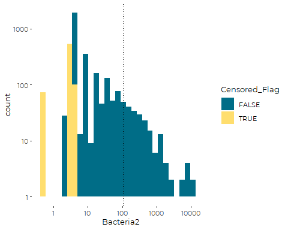
So, other than the superabundance of observations at the lower detection
limits, and perhaps a concentration of values at the maximum observed
value (right censored?), this shows every sign of being close to a
Pareto distribution. But when we try to overplot a Pareto distribution,
the scales do not appear to match (by a factor of about 5), although
shape appears reasonable.

We are fitting a Pareto distribution with minimum value `location = 0`,
and using data that has been corrected for left censoring. Results are
similar for other data sets, but the selection of minimum value has a
large effect on fit.

``` r
paretofit = vglm(Bacteria2~ 1, paretoII(location = 0) , data = beach_data)
parms <- exp(coef(paretofit))
names(parms) <- c('Scale', 'Shape')
parms
#>    Scale    Shape 
#> 9.409698 0.917774
#predict(paretofit, newdata = data.frame(x = 1))
```

``` r
ggplot(beach_data, aes(Bacteria2, fill = Censored_Flag)) +
  geom_freqpoly() +
  geom_vline(xintercept = 104, lty = 3) +
  scale_x_log10() +
  scale_y_log10() +

  theme_cbep(base_size = 10) +
  
  geom_function(fun = dparetoII,
                 args = list(location = 0,
                             scale = parms[[1]],
                             shape = parms[[2]]),
                 color = 'red')
#> `stat_bin()` using `bins = 30`. Pick better value with `binwidth`.
#> Warning: Removed 73 rows containing non-finite values (stat_bin).
#> Warning: Transformation introduced infinite values in continuous y-axis
#> Warning: Multiple drawing groups in `geom_function()`. Did you use the correct
#> `group`, `colour`, or `fill` aesthetics?
```

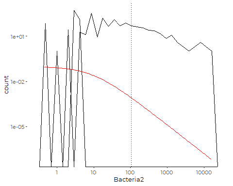

## Temporal Plots

``` r
ggplot(beach_data, aes(Year, Bacteria, color = normal_flag)) +
  geom_jitter(alpha = 0.5) +
  #geom_smooth() +
  scale_fill_manual(values = cbep_colors()) +
  geom_hline(yintercept = 104, lty = 3) +
  facet_wrap(~SiteCode, scale = 'free_y') +
  scale_y_log10() +

  theme_cbep(base_size = 10)
#> Warning: Removed 73 rows containing missing values (geom_point).
```

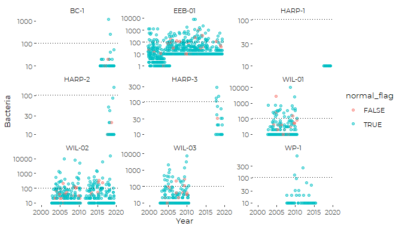

Note the early data from EEB-01 with a lower reported Reporting Limit.

## Annual Frequency of Exceedences

``` r
ggplot(beach_data, aes(Year, as.numeric(Exceeds), group = Year)) +
  stat_summary(geom = 'col', fun = mean, color = 'gray50') +
  facet_wrap(~SiteCode, scale = 'fixed') +
  theme_cbep(base_size = 10) + 
  ylab('Proportion Exceeding Standard')
#> Warning: Removed 73 rows containing non-finite values (stat_summary).
```

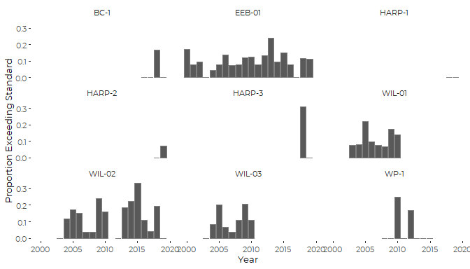

It is not obvious that the observations collected outside of the normal
schedule are any different. Quick graphical analysis and modeling
suggests it is not, but because of the highly skewed nature of the data,
that conclusion may not be entirely reliable. The available models are
not likely very sensitive to the small differences we would expect.

Without strong evidence that we need to retain the sample types in our
models, we will omit them.

# Recent Status

``` r
recent_data <- beach_data %>%
  filter(Year > 2015)

recent_data %>%
  group_by(Beach) %>%
  summarize( years = length(unique(Year)),
             median_Bacteria = median(Bacteria2, na.rm = TRUE),
             gmean_bacteria = exp(mean(log(Bacteria2),nas.rm = TRUE)),
             mean_Bacteria = mean(Bacteria2, na.rm = TRUE),
             p90_Bacteria = quantile(Bacteria2, .9),
             n = sum(! is.na(Bacteria2)),
             n_exceeds = sum(Exceeds, na.rm = TRUE),
             p_exceeds = n_exceeds / n)
#> # A tibble: 6 x 9
#>   Beach    years median_Bacteria gmean_bacteria mean_Bacteria p90_Bacteria     n
#>   <chr>    <int>           <dbl>          <dbl>         <dbl>        <dbl> <int>
#> 1 Broad C~     4            3.53           7.45         37.1         20       51
#> 2 East En~     4           10              9.43         36.1         58      103
#> 3 Mackere~     2           20             17.1          41.9        122       26
#> 4 Mitchel~     2            3.51           7.32         18.4         46       26
#> 5 Stovers~     2            3.44           3.91          4.23         7.45    25
#> 6 Willard~     4           10             14.9         244.          97      105
#> # ... with 2 more variables: n_exceeds <int>, p_exceeds <dbl>
```

Note that the median Bacteria for pretty much all of these stations is
at or below the lower detection limit. (That is possible because we have
replaced non-detects by an estimate of the conditional mean expected for
unobserved censored values). That means the data is at or below the
detection limits more than 50% of the time.

``` r
cat('Omitting non-detects\n')
#> Omitting non-detects
summary(recent_data$Enterococci)
#>    Min. 1st Qu.  Median    Mean 3rd Qu.    Max.    NA's 
#>      10      10      20     189      52   15531     165
cat('\nNon-detects at Detection Limit\n')
#> 
#> Non-detects at Detection Limit
summary(recent_data$Bacteria)
#>    Min. 1st Qu.  Median    Mean 3rd Qu.    Max. 
#>    10.0    10.0    10.0   101.1    20.0 15531.0
cat('\nNon-detects at maximum likelihood estimator\n')
#> 
#> Non-detects at maximum likelihood estimator
summary(recent_data$Bacteria2)
#>      Min.   1st Qu.    Median      Mean   3rd Qu.      Max. 
#>     3.252     3.440    10.000    97.866    20.000 15531.000
cat('\nGeometric Mean\n')
#> 
#> Geometric Mean
exp(mean(log(recent_data$Bacteria2)))
#> [1] 10.09248
cat('\n\nProbability of Violating Standards\n')
#> 
#> 
#> Probability of Violating Standards
sum(recent_data$Exceeds) / sum(! is.na(recent_data$Exceeds))
#> [1] 0.07142857
```

## Analysis of Bacteria MPN Data

### Distributions

``` r
df <- data.frame(left  = if_else(beach_data$Censored_Flag, NA_real_, 
                             beach_data$Bacteria),
             right = beach_data$Bacteria)

plotdistcens(df)
```

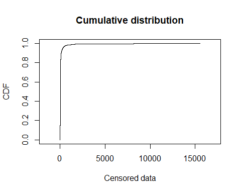

``` r
tmp <- beach_data%>%
  filter(! is.na(Bacteria)) %>%
  pull(Bacteria) %>%
descdist()
```

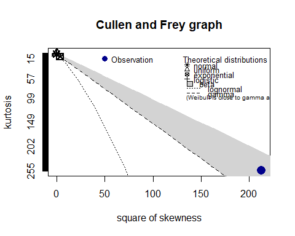

So, the distribution of bacteria levels is more skewed than a gamma
distribution.

It falls within the range of skewness and kurtosis of a beta
distribution, but the beta distribution is bounded by zero and one. So,
the only reasonable choice (?) for a GLM is likely the inverse Gaussian
family.

``` r
tmp <- beach_data%>%
  filter(! is.na(Bacteria)) %>%
  pull(Bacteria) %>%
  log() %>%
descdist()
```

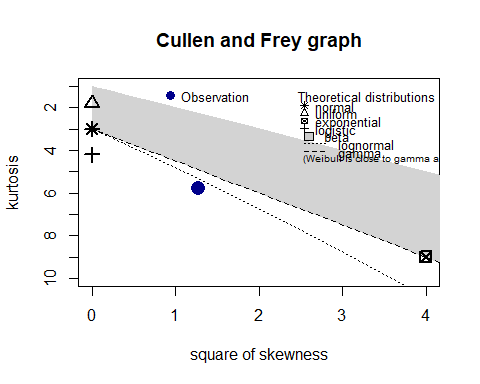
So log transformed data are not that far removed from a lognormal
distribution. We may be able to model this with a gamma or inverse
Gaussian GLM.

### Simple Log Linear Model

Although we think a simple linear model is inappropriate given the
highly skewed data, we look at it anyway as a starting point for
analysis.

``` r
test_lm <- lm(log(Bacteria) ~ Beach, data = recent_data)
plot(test_lm)
```

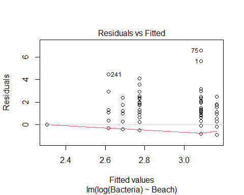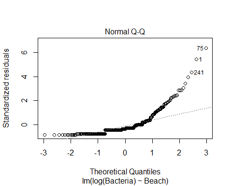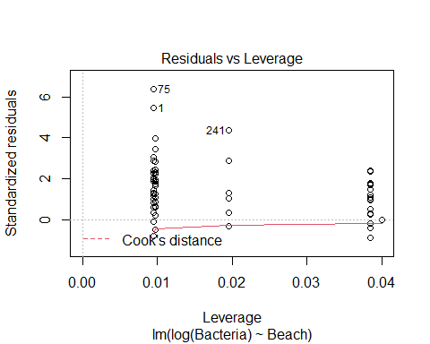
The model fails to address extreme values.

``` r
(emms <- emmeans(test_lm, "Beach", type = 'response'))
#>  Beach                  response   SE  df lower.CL upper.CL
#>  Broad Cove Reserve         13.7 1.98 330    10.28     18.2
#>  East End Beach             16.0 1.63 330    13.10     19.6
#>  Mackerel Cove              23.7 4.81 330    15.88     35.3
#>  Mitchell Field Beach       14.7 2.99 330     9.87     22.0
#>  Stovers Point Preserve     10.0 2.07 330     6.65     15.0
#>  Willard Beach              21.9 2.21 330    17.93     26.7
#> 
#> Confidence level used: 0.95 
#> Intervals are back-transformed from the log scale
```

``` r
plot(emms) + 
  xlab('Enteroccocci\n(MPN / 100 ml)') +
  coord_flip() +
  theme(axis.text.x = element_text(angle = 90, vjust = 0.25))
```

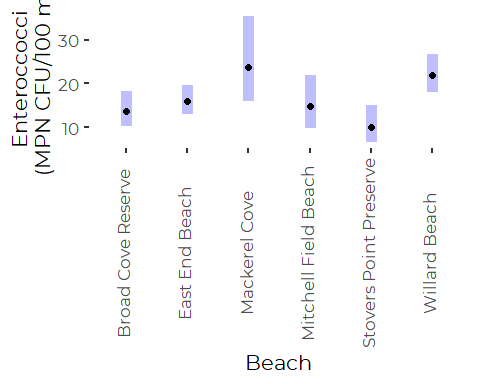

``` r
pwpp(emms)
```

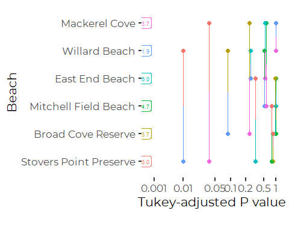

So only to pairwise comparisons are meaningful – both contrasting our
cleanest beach – Harpswell’s Stover’s Point Beach – with our two with
the highest bacteria levels – Willard Beach and Harpswell’s Mackerel
Cove Beach.

We should be aware, however, that this model was not especially a good
one, so we should take any such comparisons with a grain of salt.

#### Log Linear Model Checking “Extra” Samples

Although we think a simple linear model is probably inappropriate given
the highly skewed data, we look at it anyway as a starting point.

``` r
test_lm_2 <- lm(log(Bacteria) ~ Beach * normal_flag, data = recent_data)
anova(test_lm_2)
#> Analysis of Variance Table
#> 
#> Response: log(Bacteria)
#>                    Df Sum Sq Mean Sq F value   Pr(>F)   
#> Beach               5  19.90  3.9801  3.7064 0.002819 **
#> normal_flag         1   2.83  2.8307  2.6360 0.105436   
#> Beach:normal_flag   5   3.44  0.6871  0.6399 0.669436   
#> Residuals         324 347.92  1.0738                    
#> ---
#> Signif. codes:  0 '***' 0.001 '**' 0.01 '*' 0.05 '.' 0.1 ' ' 1
```

That suggests the “special” sampling days are not significantly
different from the normal sampling days, somewhat contrary to
expectations.

### GLM Analysis

We explored Gamma GLMs and inverse Gaussian GLMs using several link
functions, (1/mu^2, inverse, identity). Results are qualitatively
similar. The inverse Gaussian models perform relatively poorly (based on
model diagnostic plots), so we only show results of the Gamma GLM.

#### Gamma GLM

``` r
gamma_glm <- glm(log(Bacteria) ~ Beach, 
                family = Gamma(), 
                data = recent_data)
```

``` r
boot::glm.diag.plots(gamma_glm)
```

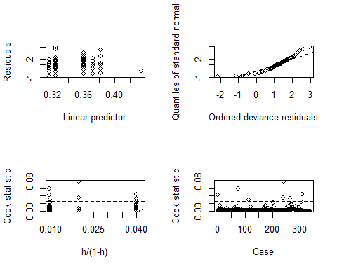

``` r
(emms <- emmeans(gamma_glm, "Beach", type = 'response'))
#>  Beach                  response   SE  df asymp.LCL asymp.UCL
#>  Broad Cove Reserve         13.7 1.77 Inf     10.60      17.6
#>  East End Beach             16.0 1.55 Inf     13.25      19.4
#>  Mackerel Cove              23.7 5.21 Inf     15.40      36.4
#>  Mitchell Field Beach       14.7 2.75 Inf     10.21      21.2
#>  Stovers Point Preserve     10.0 1.63 Inf      7.26      13.8
#>  Willard Beach              21.9 2.33 Inf     17.75      27.0
#> 
#> Confidence level used: 0.95 
#> Intervals are back-transformed from the log scale
```

The negative lower confidence limits are clearly a problem. The rank
order of predicted values and their approximate values all appear more
or less appropriate, but we have little confidence in the model, and its
strongest result is that sites do not differ in average bacteria levels.

``` r
plot(emms) + 
  xlab('Enteroccocci\n(MPN / 100 ml)') +
  coord_flip()
```

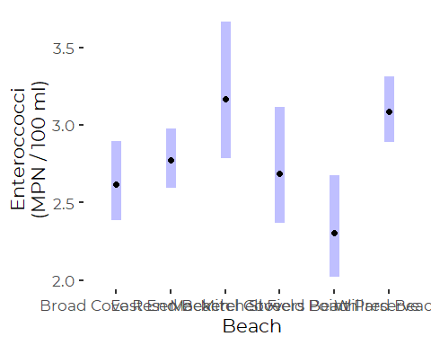

``` r
pwpp(emmeans(gamma_glm, "Beach"))
#> Note: Use 'contrast(regrid(object), ...)' to obtain contrasts of back-transformed estimates
```


#### Pareto GLM

The Gamma GLM does not address these highly skewed data adequately.
Further models would need to focus on zero inflated models or Pareto
distributed errors, or both. Our efforts to use Pareto models in VGAM
have been frustrated by the package’s relative complexity.

We ran into estimation problems when we included the Stover’s Point
Preserve site in the model, apparently because the data is almost all
non-detects.

``` r
pareto_vglm <- vglm(Bacteria2 ~ Beach, 
                    paretoII, data = recent_data, 
                    subset = Beach != 'Stovers Point Preserve',
                    maxit = 50)
anova.vglm(pareto_vglm)  # ANOVA returns an error
#> Analysis of Deviance Table (Type II tests)
#> 
#> Model: 'paretoII'
#> 
#> Links: 'loglink'
#> 
#> Response: Bacteria2
#> 
#>       Df 2 * LogLik Diff. Resid. Df  LogLik Pr(>Chi)  
#> Beach  8           15.874       620 -1296.3  0.04421 *
#> ---
#> Signif. codes:  0 '***' 0.001 '**' 0.01 '*' 0.05 '.' 0.1 ' ' 1
```

So that shows we do have differences among sites. It’s hard to isolate
those differences, however.

``` r
summary(pareto_vglm)
#> 
#> Call:
#> vglm(formula = Bacteria2 ~ Beach, family = paretoII, data = recent_data, 
#>     subset = Beach != "Stovers Point Preserve", maxit = 50)
#> 
#> Coefficients: 
#>                              Estimate Std. Error z value Pr(>|z|)    
#> (Intercept):1                2.404708   0.538789   4.463 8.08e-06 ***
#> (Intercept):2                0.425586   0.355102   1.198    0.231    
#> BeachEast End Beach:1        0.017625   0.647556   0.027    0.978    
#> BeachEast End Beach:2       -0.183167   0.419901  -0.436    0.663    
#> BeachMackerel Cove:1         1.094093   0.941680   1.162    0.245    
#> BeachMackerel Cove:2         0.072739   0.628785   0.116    0.908    
#> BeachMitchell Field Beach:1 -0.001568   0.924314  -0.002    0.999    
#> BeachMitchell Field Beach:2 -0.011212   0.607512  -0.018    0.985    
#> BeachWillard Beach:1         0.022258   0.634116   0.035    0.972    
#> BeachWillard Beach:2        -0.496798   0.402019  -1.236    0.217    
#> ---
#> Signif. codes:  0 '***' 0.001 '**' 0.01 '*' 0.05 '.' 0.1 ' ' 1
#> 
#> Names of linear predictors: loglink(scale), loglink(shape)
#> 
#> Log-likelihood: -1288.37 on 612 degrees of freedom
#> 
#> Number of Fisher scoring iterations: 40 
#> 
#> No Hauck-Donner effect found in any of the estimates
```

None of the individual parameter are significant, so comparison to the
base case (Willard Beach) is not where the differences lie.
Unfortunately, `emmeans()` does not support `vglm` models. We use
predict instead. Since we are not certain of how to evaluate
significance of pairwise comparisons of the Pareto parameters, we
provide only qualitative interpretation.

``` r
sites<- tibble(Beach = unique(recent_data$Beach)) %>%
  filter(Beach != 'Stovers Point Preserve')
p <- predict(pareto_vglm, newdata = sites, se = TRUE)

ptab = cbind(p$fitted.values, p$se.fit)
rownames(ptab) <-  sites$Beach
colnames(ptab) = c('log_Scale', 'log_Shape', 'log_Scale_SD', 'log_Shape_SD')
ptab
#>                      log_Scale   log_Shape log_Scale_SD log_Shape_SD
#> Willard Beach         2.426966 -0.07121183    0.3343783    0.1884721
#> East End Beach        2.422333  0.24241966    0.3592155    0.2240963
#> Broad Cove Reserve    2.404708  0.42558649    0.5387891    0.3551020
#> Mackerel Cove         3.498801  0.49832538    0.7723127    0.5189160
#> Mitchell Field Beach  2.403140  0.41437446    0.7510417    0.4929230
```

The call to `predict()` returns estimates of model parameters, which
here include not a mean or standard deviation, but (log transformed)
estimates of the parameters of an implied Pareto distribution for each
beach.

Parameters are generally similar for all sites, except:  
1. Willard Beach has a low (negative log) shape value. That implies a
very heavy “tail” at that site.  
2. Mackerel Cove has a high scale parameter and the highest shape
parameter (by a small, statistically uncertain amount). That implies a
relatively high level of bacteria, but lower frequency of very high
observations than that might suggest.

The negative loglink(shape) parameter for Willard Beach suggests a shape
parameter less than 1, which implies a Pareto distribution with such
heavy tails as to have no defined variance. That appears likely to be a
meaningful difference from most other beaches, based on eyeing the
standard errors.

##### Moments of the Pareto Distribution

We can estimate moments from the parameters. Wikipedia reports the
moments of (this variant of) the Pareto Distribution as:

$$ E(x) = \\frac{\\sigma}{\\alpha - 1} + \\mu  \\quad \\alpha &gt; 1$$

Where:  
\* *σ* is the SCALE parameter  
\* *α* is the SHAPE parameter  
\* *μ* is the Location parameter (minimum possible value, here zero)

So the mean goes UP with SCALE and DOWN with SHAPE.

Variance (for *μ* = 0) is:
$$ Var(x) = \\frac{\\sigma^2 \\alpha}{(\\alpha-1)^2(\\alpha-2)}  \\quad \\alpha &gt; 2$$
For *α* &lt; 2, it is infinite. For *α* &lt; 1 it is undefined.

So, variance also tends to go UP with SCALE and DOWN with SHAPE.

##### Pareto Interpretation

We can conclude:  
\* Willard Beach has moderate levels over all, but a high probability of
very high observations. \* Mackerel Cove has relatively high overall
levels, but chances of extreme value as at that site are lower than
expected based on that average.

##### Notes on Interpreting Parameters

We can get a feel for the implications of shape and scale parameters by
plotting Pareto densities.

``` r
ggplot() +
  scale_x_log10(limits = c(1,1000)) +
  #scale_y_log10() +

  theme_cbep(base_size = 10) +
  
  geom_function(fun = dparetoII,
                 args = list(location = 0,
                             scale = 1,
                             shape = 1),
                 color = 'red') +
  
  geom_function(fun = dparetoII,
                 args = list(location = 0,
                             scale = 2,
                             shape = 1),
                 color = 'orange') +
  geom_function(fun = dparetoII,
                 args = list(location = 0,
                             scale = 5,
                             shape = 1),
                 color = 'yellow') +
      geom_function(fun = dparetoII,
                 args = list(location = 0,
                             scale = 10,
                             shape = 1),
                 color = 'black')
```

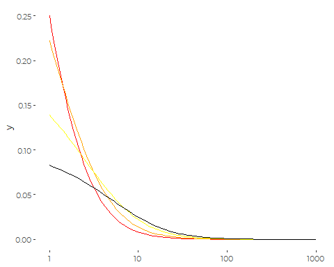
So, as SCALE goes up, low values drop, mid and higher values rise.

``` r
ggplot() +
  scale_x_log10(limits = c(1,1000)) +
  #scale_y_log10() +

  theme_cbep(base_size = 10) +
  
  geom_function(fun = dparetoII,
                 args = list(location = 0,
                             scale = 5,
                             shape = .1),
                 color = 'red') +
  
  geom_function(fun = dparetoII,
                 args = list(location = 0,
                             scale = 5,
                             shape = 1),
                 color = 'orange') +
  geom_function(fun = dparetoII,
                 args = list(location = 0,
                             scale = 5,
                             shape = 2),
                 color = 'yellow') +
      geom_function(fun = dparetoII,
                 args = list(location = 0,
                             scale = 5,
                             shape = 5),
                 color = 'black')
```

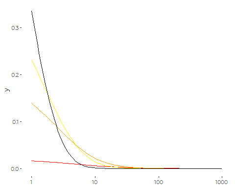
The SHAPE parameter has to do with how closely the distribution hugs
towards the “origin” – more correctly the location parameter, which is
the minimum.

Low shape spreads things out a bit more. High shape pulls things in
closely.

A classic Pareto (I) distribution has `location = 1`. here we use
`location = 0`, as that makes both better scientific sense and allows
our values adjusted for censoring ( at `Reporting_Limit == 1`) to be
incorporated in the models.

### Non-parametric Tests

We proceed to a nonparametric analysis. This is useful for a one way
analysis, but does not lend itself to testing more complex models.

``` r
kruskal.test(Bacteria2 ~ Beach, data = recent_data)
#> 
#>  Kruskal-Wallis rank sum test
#> 
#> data:  Bacteria2 by Beach
#> Kruskal-Wallis chi-squared = 31.676, df = 5, p-value = 6.885e-06
```

Although the Kruskal-Wallis test is not strictly a comparison of
medians, it’s close, so we can look at medians.

``` r
recent_data %>%
  group_by(Beach) %>%
  summarize(Median = median(Bacteria2),
            iqr = IQR(Bacteria2),
            p90 = quantile(Bacteria2, .9))
#> # A tibble: 6 x 4
#>   Beach                  Median    iqr    p90
#>   <chr>                   <dbl>  <dbl>  <dbl>
#> 1 Broad Cove Reserve       3.53  6.58   20   
#> 2 East End Beach          10    16.6    58   
#> 3 Mackerel Cove           20    35.0   122   
#> 4 Mitchell Field Beach     3.51 14.1    46   
#> 5 Stovers Point Preserve   3.44  0.154   7.45
#> 6 Willard Beach           10    37.5    97
```

These data include our (simulated, thus random) estimates of expected
values of censored values. Thus any values under 10 imply that the
median observation is really just a non-detect. Minor differences in
those medians are due to random variation in simulations. For those
sites, a comparison of the interquartile ranges and p90 scores are most
appropriate.

``` r
pairwise.wilcox.test(recent_data$Bacteria2, recent_data$Beach,
                 p.adjust.method = "holm")
#> Warning in wilcox.test.default(xi, xj, paired = paired, ...): cannot compute
#> exact p-value with ties

#> Warning in wilcox.test.default(xi, xj, paired = paired, ...): cannot compute
#> exact p-value with ties

#> Warning in wilcox.test.default(xi, xj, paired = paired, ...): cannot compute
#> exact p-value with ties
#> 
#>  Pairwise comparisons using Wilcoxon rank sum test with continuity correction 
#> 
#> data:  recent_data$Bacteria2 and recent_data$Beach 
#> 
#>                        Broad Cove Reserve East End Beach Mackerel Cove
#> East End Beach         1.00000            -              -            
#> Mackerel Cove          0.03248            0.11718        -            
#> Mitchell Field Beach   1.00000            1.00000        0.11966      
#> Stovers Point Preserve 0.12655            0.02617        0.00021      
#> Willard Beach          0.06463            0.14281        1.00000      
#>                        Mitchell Field Beach Stovers Point Preserve
#> East End Beach         -                    -                     
#> Mackerel Cove          -                    -                     
#> Mitchell Field Beach   -                    -                     
#> Stovers Point Preserve 0.47614              -                     
#> Willard Beach          0.14281              9e-05                 
#> 
#> P value adjustment method: holm
```

### Conclusions

Linear models and Generalized Linear Models were not very useful. Each
failed to address extreme values with any authority. The Pareto model
provided insight into occurrence of extreme values (although without
clear support for hypothesis tests), and the nonparametric methods
provide a more robust analysis.

Luckily, conclusions of all analyses are generally in agreement with
regard to qualitative findings.

Harpswell’s Stover’s Point Preserve has the lowest bacteria levels of
any of Casco Bay’s regularly monitored beaches. Based on the
nonparametric analysis, its bacteria level is lower than that of all
sites except Mitchell Field Beach. (p values less than 0.1; if you use a
p &lt; 0.05 standard, the difference with Broad Cove becomes
questionable.)

Two other sites with similar median values – Broad Cover Reserve and
Mitchell Field Beach – showed slightly higher probability of elevated
bacteria levels, but given the limited data, such differences are not
robust.

Our two most urban beaches, East End Beach and Willard Beach East End
Beach, while showing slightly higher median values, also have many
observations where bacteria were not detected, so observed differences
with other beaches are not robust.

The highest bacteria levels were observed at Mackerel Cove, but
differences are only statistically robust when compared to the cleanest
Casco Bay beaches.

The Pareto analysis suggests an important distinction between the two
beaches the highest levels of bacteria – Mackerel Cove and Willard
Beach. While elevated levels are more abundant at Mackerel Cove, when
things are bad at Willard Beach, they have sometimes been exceptionally
high.

## Analyzing Exceedences of Standards

An alternative modeling approach emphasizes the frequency of violations
of water quality standards. Given the highly skewed nature of data on
bacteria counts, this transforms a difficult quantitative analysis into
a simpler binomial analysis.

We can instead model probability that a site exceeds applicable water
quality standards.

### Binomial Model

``` r
exceeds_glm <- glm(Exceeds ~ Beach, family = 'binomial', 
                   data = recent_data)
anova(exceeds_glm, test = 'LRT')
#> Analysis of Deviance Table
#> 
#> Model: binomial, link: logit
#> 
#> Response: Exceeds
#> 
#> Terms added sequentially (first to last)
#> 
#> 
#>       Df Deviance Resid. Df Resid. Dev Pr(>Chi)
#> NULL                    335     172.92         
#> Beach  5   7.5676       330     165.35   0.1817
```

Sites do not differ in the probability of violating instantaneous water
quality standards.

``` r
summary(exceeds_glm)
#> 
#> Call:
#> glm(formula = Exceeds ~ Beach, family = "binomial", data = recent_data)
#> 
#> Deviance Residuals: 
#>     Min       1Q   Median       3Q      Max  
#> -0.5780  -0.4234  -0.4021  -0.2829   2.5527  
#> 
#> Coefficients:
#>                              Estimate Std. Error z value Pr(>|z|)    
#> (Intercept)                   -3.1987     0.7214  -4.434 9.25e-06 ***
#> BeachEast End Beach            0.7242     0.8099   0.894   0.3712    
#> BeachMackerel Cove             1.4939     0.9032   1.654   0.0981 .  
#> BeachMitchell Field Beach     -0.0202     1.2492  -0.016   0.9871    
#> BeachStovers Point Preserve  -15.3674  1304.5279  -0.012   0.9906    
#> BeachWillard Beach             0.8316     0.8012   1.038   0.2993    
#> ---
#> Signif. codes:  0 '***' 0.001 '**' 0.01 '*' 0.05 '.' 0.1 ' ' 1
#> 
#> (Dispersion parameter for binomial family taken to be 1)
#> 
#>     Null deviance: 172.92  on 335  degrees of freedom
#> Residual deviance: 165.35  on 330  degrees of freedom
#> AIC: 177.35
#> 
#> Number of Fisher Scoring iterations: 17
```

Note the exceptionally high standard error for Stover’s Point. No sample
from that site has failed water quality criteria, so the estimation is
unstable.

We repeat the analysis, omitting that site, to improve model performance
and check if results are changed in any way.

``` r
exceeds_glm_2<- glm(Exceeds ~ Beach, family = 'binomial',  
                    data = recent_data,
                    subset = Beach != 'HARP-1')
anova(exceeds_glm_2, test = 'LRT')
#> Analysis of Deviance Table
#> 
#> Model: binomial, link: logit
#> 
#> Response: Exceeds
#> 
#> Terms added sequentially (first to last)
#> 
#> 
#>       Df Deviance Resid. Df Resid. Dev Pr(>Chi)
#> NULL                    335     172.92         
#> Beach  5   7.5676       330     165.35   0.1817
```

That does not alter our conclusions.

# Trend Analysis

We only have long term data from two beaches – East end and Willard.

``` r
trend_data <- beach_data %>%
  filter(grepl('WIL', SiteCode) | SiteCode == 'EEB-01') %>%
  filter(! is.na(Bacteria2))
```

## Initial Graphic

``` r
ggplot(trend_data, aes(x = Year, y = Bacteria2, color = Beach)) +
  geom_jitter(alpha = 1, height = 0.025, width = 0.2) +
  scale_y_log10() +
  
  xlab('') +
  ylab('Enterococci (MPN)') +
  
  theme_cbep(base_size = 12) +
  scale_color_manual(values = cbep_colors()) +
  theme(legend.position = 'bottom') +
  facet_wrap(~Beach, nrow = 2)
```

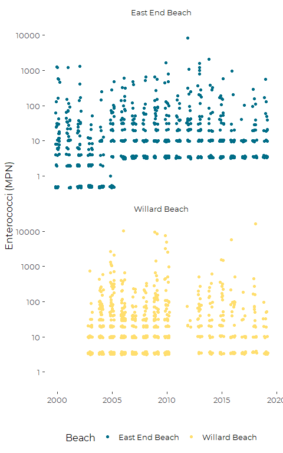

We have several problems with trend analysis here. The first stems from
the early data from East End Beach, which has a lower detection limit
than later data. Since a high proportion of observations are
non-detects, our estimate of trends may be dominated by detection
limits. We could take three approaches:

1.  Collapse all low values (below 10) to a pseudo non-detect
    category;  
2.  Construct a model that explicitly addresses the probability of a
    non-detect over time;  
3.  Just drop the earliest data.

Number 3 is most straight forward. The lower detection limits were used
prior to 2005.

The second is that we have no recent data from two of the three Willard
Beach monitoring locations. It MAY be appropriate to collapse that data,
but we can not be sure without conducting principled analysis. Also,
since observations were collected at all three locations at Willard
Beach on the same days, they are correlated, and we have to model them
as such. Given the difficulty we have had identifying models that handle
the highly skewed bacteria data adequately, We are not confident that
complex models will address those correlations adequately.

## Restricted Data

We restrict attention only to WIL-02 at Willard Beach.

``` r
trend_data <- beach_data %>%
  filter(SiteCode == 'WIL-02' | SiteCode == 'EEB-01') %>%
  filter(! is.na(Bacteria2)) %>%
  filter(SiteCode == 'EEB-01' | Year > 2004) %>%    # Remove Willard early data
  filter(Reporting_Limit > 5 | is.na(Reporting_Limit)) # Remove data with low RL
```

## Thiel-Sen Slopes (unsuccessful)

``` r
ts_models <- trend_data %>%
  filter(! is.na(Beach), ! is.na(Bacteria2)) %>%
  mutate(log_B = log(Bacteria2)) %>%
  group_by(Beach) %>%
  nest() %>%
  mutate(first.mblm = map(data, function(df) mblm(Bacteria2 ~ Year, df))) %>%
  mutate(second.mblm = map(data, function(df) mblm(log_B ~ Year, df)))
```

``` r
map(ts_models$first.mblm, summary)
#> [[1]]
#> 
#> Call:
#> mblm(formula = Bacteria2 ~ Year, dataframe = df)
#> 
#> Residuals:
#>     Min      1Q  Median      3Q     Max 
#>   -16.8   -16.5     0.0    32.0 15511.0 
#> 
#> Coefficients:
#>             Estimate      MAD V value Pr(>|V|)  
#> (Intercept)   20.000 3306.198   40328   0.0156 *
#> Year           0.000    1.647   19875   0.1537  
#> ---
#> Signif. codes:  0 '***' 0.001 '**' 0.01 '*' 0.05 '.' 0.1 ' ' 1
#> 
#> Residual standard error: 1133 on 373 degrees of freedom
#> 
#> 
#> [[2]]
#> 
#> Call:
#> mblm(formula = Bacteria2 ~ Year, dataframe = df)
#> 
#> Residuals:
#>    Min     1Q Median     3Q    Max 
#>   -6.8   -6.5    0.0   21.0 8150.0 
#> 
#> Coefficients:
#>             Estimate      MAD V value Pr(>|V|)    
#> (Intercept)   10.000 2170.675   89247 1.68e-05 ***
#> Year           0.000    1.082   32209   0.0629 .  
#> ---
#> Signif. codes:  0 '***' 0.001 '**' 0.01 '*' 0.05 '.' 0.1 ' ' 1
#> 
#> Residual standard error: 533.8 on 540 degrees of freedom
```

A regression at Willard Beach is marginally significant, but the
their-sen slope is zero.

``` r
map(ts_models$second.mblm, summary)
#> [[1]]
#> 
#> Call:
#> mblm(formula = log_B ~ Year, dataframe = df)
#> 
#> Residuals:
#>     Min      1Q  Median      3Q     Max 
#> -1.8324 -1.7352  0.0000  0.9555  6.6549 
#> 
#> Coefficients:
#>             Estimate      MAD V value Pr(>|V|)   
#> (Intercept)   2.9957 229.1682   40861  0.00756 **
#> Year          0.0000   0.1142   19235  0.06277 . 
#> ---
#> Signif. codes:  0 '***' 0.001 '**' 0.01 '*' 0.05 '.' 0.1 ' ' 1
#> 
#> Residual standard error: 1.655 on 373 degrees of freedom
#> 
#> 
#> [[2]]
#> 
#> Call:
#> mblm(formula = log_B ~ Year, dataframe = df)
#> 
#> Residuals:
#>    Min     1Q Median     3Q    Max 
#> -1.148 -1.063  0.000  1.131  6.704 
#> 
#> Coefficients:
#>             Estimate      MAD V value Pr(>|V|)    
#> (Intercept)   2.3026 295.9661   89296 1.62e-05 ***
#> Year          0.0000   0.1468   31681   0.0351 *  
#> ---
#> Signif. codes:  0 '***' 0.001 '**' 0.01 '*' 0.05 '.' 0.1 ' ' 1
#> 
#> Residual standard error: 1.561 on 540 degrees of freedom
```

Thiel-Sen slopes are all zero, presumably because most observations are
non-detects, and so pairwise slopes between points are mostly also zero.
Since we are looking at a median of those slopes, we end up at zero.

## Log Linear Model

``` r
trend_lm <- lm(log(Bacteria2) ~ Beach * Year, data = trend_data)
anova(trend_lm)
#> Analysis of Variance Table
#> 
#> Response: log(Bacteria2)
#>             Df  Sum Sq Mean Sq F value   Pr(>F)   
#> Beach        1   25.05 25.0510 10.0572 0.001568 **
#> Year         1    5.57  5.5736  2.2377 0.135031   
#> Beach:Year   1    0.72  0.7241  0.2907 0.589910   
#> Residuals  913 2274.14  2.4908                    
#> ---
#> Signif. codes:  0 '***' 0.001 '**' 0.01 '*' 0.05 '.' 0.1 ' ' 1
```

``` r
summary(trend_lm)
#> 
#> Call:
#> lm(formula = log(Bacteria2) ~ Beach * Year, data = trend_data)
#> 
#> Residuals:
#>     Min      1Q  Median      3Q     Max 
#> -1.8463 -1.3805 -0.3192  0.9060  6.7598 
#> 
#> Coefficients:
#>                          Estimate Std. Error t value Pr(>|t|)
#> (Intercept)              53.49498   35.32974   1.514    0.130
#> BeachWillard Beach      -26.63260   50.02185  -0.532    0.595
#> Year                     -0.02528    0.01756  -1.440    0.150
#> BeachWillard Beach:Year   0.01341    0.02486   0.539    0.590
#> 
#> Residual standard error: 1.578 on 913 degrees of freedom
#> Multiple R-squared:  0.0136, Adjusted R-squared:  0.01036 
#> F-statistic: 4.195 on 3 and 913 DF,  p-value: 0.005835
```

``` r
year_trends <- emtrends(trend_lm, ~ Beach, var = "Year")
year_trends
#>  Beach          Year.trend     SE  df lower.CL upper.CL
#>  East End Beach    -0.0253 0.0176 913  -0.0598  0.00918
#>  Willard Beach     -0.0119 0.0176 913  -0.0464  0.02267
#> 
#> Confidence level used: 0.95
```

## Gamma GLM

``` r
trend_glm <- glm(log(Bacteria2) ~ Beach * Year, 
                 family = Gamma(),
                 data = trend_data)
anova(trend_glm, test = 'LRT')
#> Analysis of Deviance Table
#> 
#> Model: Gamma, link: inverse
#> 
#> Response: log(Bacteria2)
#> 
#> Terms added sequentially (first to last)
#> 
#> 
#>            Df Deviance Resid. Df Resid. Dev Pr(>Chi)   
#> NULL                         916     285.20            
#> Beach       1   3.2323       915     281.97 0.001654 **
#> Year        1   0.7115       914     281.25 0.139915   
#> Beach:Year  1   0.1685       913     281.09 0.472558   
#> ---
#> Signif. codes:  0 '***' 0.001 '**' 0.01 '*' 0.05 '.' 0.1 ' ' 1
```

``` r
summary(trend_glm)
#> 
#> Call:
#> glm(formula = log(Bacteria2) ~ Beach * Year, family = Gamma(), 
#>     data = trend_data)
#> 
#> Deviance Residuals: 
#>     Min       1Q   Median       3Q      Max  
#> -0.8210  -0.6655  -0.1257   0.3046   1.5522  
#> 
#> Coefficients:
#>                          Estimate Std. Error t value Pr(>|t|)
#> (Intercept)             -7.034066   4.900825  -1.435    0.152
#> BeachWillard Beach       4.651246   6.537553   0.711    0.477
#> Year                     0.003686   0.002436   1.513    0.131
#> BeachWillard Beach:Year -0.002334   0.003250  -0.718    0.473
#> 
#> (Dispersion parameter for Gamma family taken to be 0.3265365)
#> 
#>     Null deviance: 285.20  on 916  degrees of freedom
#> Residual deviance: 281.09  on 913  degrees of freedom
#> AIC: 3155.5
#> 
#> Number of Fisher Scoring iterations: 5
```

``` r
year_trends <- emtrends(trend_glm, ~ Beach, var = "Year")
year_trends
#>  Beach          Year.trend      SE  df asymp.LCL asymp.UCL
#>  East End Beach    0.00369 0.00244 Inf  -0.00109   0.00846
#>  Willard Beach     0.00135 0.00215 Inf  -0.00286   0.00557
#> 
#> Results are given on the log (not the response) scale. 
#> Confidence level used: 0.95
```

Note that the linear predictor here is the inverse, which means positive
predictors suggest the inverse is increasing, so the response must be
declining, although not significantly so here.

So, our conclusions are again robust – we do not see evidence of changes
in levels of bacteria observed at either beach.

## Binomial GLM

``` r
exceeds_trend_glm <- glm(Exceeds ~ Beach * Year, family = 'binomial', 
                   data = trend_data)
anova(exceeds_trend_glm, test = 'LRT')
#> Analysis of Deviance Table
#> 
#> Model: binomial, link: logit
#> 
#> Response: Exceeds
#> 
#> Terms added sequentially (first to last)
#> 
#> 
#>            Df Deviance Resid. Df Resid. Dev Pr(>Chi)
#> NULL                         916     700.18         
#> Beach       1  2.05219       915     698.13   0.1520
#> Year        1  0.03592       914     698.10   0.8497
#> Beach:Year  1  0.00327       913     698.09   0.9544
```

We again see no evidence for a trend.

## Conclusions

We have no evidence for trends over the full record, but we should
report that result with appropriate humility. We noted some apparently
statistically significant trends when analyzing different subsets of the
data. Those may result from inadvertent “cherry picking” of the data, or
because of short-term observable trends. Also, we lack good,
consistently controlled predictors for the entire period of record,a s
some methods changed
