Impact of Rainfall on Bacteria Levels at Casco Bay Beaches
================
Curtis C. Bohlen, Casco Bay Estuary Partnership.
01/23/2021

-   [Introduction](#introduction)
-   [Import Libraries](#import-libraries)
-   [Data Preparation](#data-preparation)
    -   [Initial Folder References](#initial-folder-references)
    -   [Load Data](#load-data)
    -   [Add a “Beach” Identifier](#add-a-beach-identifier)
    -   [Add a “Day of the Week”
        Identifier](#add-a-day-of-the-week-identifier)
    -   [Normal and Conditional
        Samples](#normal-and-conditional-samples)
        -   [Results](#results)
        -   [Add The Indicator](#add-the-indicator)
    -   [Add Maximum Likelihood Estimate for
        non-detects](#add-maximum-likelihood-estimate-for-non-detects)
    -   [Calculate Exceedences](#calculate-exceedences)
-   [Recent Data](#recent-data)
    -   [Analysis of Bacteria MPN Data](#analysis-of-bacteria-mpn-data)
        -   [Log Linear Models](#log-linear-models)
        -   [GLM Analysis](#glm-analysis)
        -   [Binomial Model](#binomial-model)
-   [Trend Analysis](#trend-analysis)
    -   [Log Linear Model](#log-linear-model)
    -   [Gamma GLM](#gamma-glm-1)


# Introduction

To be added….

\#\#Standards 104 CFU / 100 ml, for individual observations.

# Import Libraries

``` r
library(fitdistrplus)
#> Loading required package: MASS
#> Loading required package: survival
library(tidyverse)
#> Warning: package 'tidyverse' was built under R version 4.0.5
#> -- Attaching packages --------------------------------------- tidyverse 1.3.1 --
#> v ggplot2 3.3.3     v purrr   0.3.4
#> v tibble  3.1.2     v dplyr   1.0.6
#> v tidyr   1.1.3     v stringr 1.4.0
#> v readr   1.4.0     v forcats 0.5.1
#> Warning: package 'tidyr' was built under R version 4.0.5
#> Warning: package 'dplyr' was built under R version 4.0.5
#> Warning: package 'forcats' was built under R version 4.0.5
#> -- Conflicts ------------------------------------------ tidyverse_conflicts() --
#> x dplyr::filter() masks stats::filter()
#> x dplyr::lag()    masks stats::lag()
#> x dplyr::select() masks MASS::select()

# library(GGally)

library(mgcv)      # For GAMs and GAMMs; used here for seasonal smoothers
#> Warning: package 'mgcv' was built under R version 4.0.5
#> Loading required package: nlme
#> 
#> Attaching package: 'nlme'
#> The following object is masked from 'package:dplyr':
#> 
#>     collapse
#> This is mgcv 1.8-35. For overview type 'help("mgcv-package")'.
library(emmeans)   # For marginal means

library(mblm)      # for the Thiel-Sen estimators

library(CBEPgraphics)
load_cbep_fonts()
theme_set(theme_cbep())

library(LCensMeans)
```

# Data Preparation

## Initial Folder References

``` r
sibfldnm    <- 'Derived_Data'
parent      <- dirname(getwd())
sibling     <- file.path(parent,sibfldnm)

#dir.create(file.path(getwd(), 'figures'), showWarnings = FALSE)
#dir.create(file.path(getwd(), 'models'),  showWarnings = FALSE)
```

## Load Data

``` r
fn <- "beaches_data.csv"
beach_data <- read_csv(file.path(sibling, fn))
#> 
#> -- Column specification --------------------------------------------------------
#> cols(
#>   .default = col_double(),
#>   SiteCode = col_character(),
#>   sdatetime = col_datetime(format = ""),
#>   sdate = col_date(format = ""),
#>   Sample_ID = col_character(),
#>   Sample_Qualifier = col_character(),
#>   Lab_Qualifier = col_character(),
#>   Censored_Flag = col_logical(),
#>   Weather = col_character(),
#>   Past24HR_Weather = col_character(),
#>   Past48HR_Weather = col_character(),
#>   Tide_Stage = col_logical(),
#>   Water_Surface = col_character(),
#>   Current = col_logical()
#> )
#> i Use `spec()` for the full column specifications.
```

``` r
names(beach_data)
#>  [1] "SiteCode"         "sdatetime"        "sdate"            "Year"            
#>  [5] "Month"            "DOY"              "Sample_ID"        "Sample_Qualifier"
#>  [9] "Enterococci"      "Reporting_Limit"  "Lab_Qualifier"    "Bacteria"        
#> [13] "Censored_Flag"    "Rain24"           "Rain48"           "Salinity"        
#> [17] "Air_Temp"         "Water_Temp"       "Weather"          "Past24HR_Weather"
#> [21] "Past48HR_Weather" "Tide_Stage"       "Water_Surface"    "Current"
```

## Add a “Beach” Identifier

``` r
fn = "beach_locations.csv"
beach_lookup = read_csv(file.path(sibling, fn),
                        col_types = cols(
                          Town = col_character(),
                          Beach_Name = col_character(),
                          SamplePoint = col_character(),
                          Latitude = col_double(),
                          Longitude = col_double()
                        )) %>%
  select(-Latitude, -Longitude)

beach_data <- beach_data %>%
  mutate(Beach = beach_lookup$Beach_Name[match(SiteCode, 
                                               beach_lookup$SamplePoint)])
```

## Add a “Day of the Week” Identifier

We need this to help evaluate whether samples are “normal” samples or
“storm” samples.

``` r
beach_data <- beach_data %>%
  mutate(Weekday = weekdays(sdate)) %>%
  relocate(Weekday, .after = Month)
```

## Normal and Conditional Samples

The Beaches program principally collects samples from each beach on
specific days of the week. Samples collected on other days may be
“non-standard” samples. For example, protocol after a beach closure is
to test a few days later to see if levels of bacteria have returned to
safe levels. We should not expect such conditional samples to have the
same distribution of bacteria levels as normal samples.

Unfortunately, records are not entriely reliable on this matter, so the
best we can do is figure out if samples wer collected on a “normal” day
of hte week.

We look at Crosstabs by year to figure out the pattern.

``` r
dow <- xtabs(~Year + Weekday + Beach , data = beach_data)
dow
#> , , Beach = Broad Cove Reserve
#> 
#>       Weekday
#> Year   Friday Monday Saturday Sunday Thursday Tuesday Wednesday
#>   2000      0      0        0      0        0       0         0
#>   2001      0      0        0      0        0       0         0
#>   2002      0      0        0      0        0       0         0
#>   2003      0      0        0      0        0       0         0
#>   2004      0      0        0      0        0       0         0
#>   2005      0      0        0      0        0       0         0
#>   2006      0      0        0      0        0       0         0
#>   2007      0      0        0      0        0       0         0
#>   2008      0      0        0      0        0       0         0
#>   2009      0      0        0      0        0       0         0
#>   2010      0      0        0      0        0       0         0
#>   2011      0      0        0      0        0       0         0
#>   2012      0      0        0      0        0       0         0
#>   2013      0      0        0      0        0       0         0
#>   2014      0      0        0      0        0       0         0
#>   2015      0      0        0      0        0       0         0
#>   2016      0      0        0      0        0       0        14
#>   2017      0      0        0      0        1       0        11
#>   2018      0      0        0      0        1       0        11
#>   2019      0      0        0      0        0       0        13
#> 
#> , , Beach = East End Beach
#> 
#>       Weekday
#> Year   Friday Monday Saturday Sunday Thursday Tuesday Wednesday
#>   2000     13     13        0      0        1       0        14
#>   2001     12     13        0      0        1       0        12
#>   2002     14     14        0      0        0       0        14
#>   2003     13     13        0      0        0       1        14
#>   2004     13     12        0      0        2       3        14
#>   2005     12     12        0      0        0       2        13
#>   2006     13     11        1      1        2       3        13
#>   2007     13     12        0      0        3       1        12
#>   2008     12     13        0      0        0       1        13
#>   2009     14     14        0      0        0       0        14
#>   2010     17     15        0      0        5       3        17
#>   2011     13     14        0      0        1       0        12
#>   2012     15     13        1      1        1       0        14
#>   2013     13     14        1      0        1       0        13
#>   2014     13     12        0      0        3       0        14
#>   2015     13     14        0      0        0       0        13
#>   2016      0      0        0      0       13      13         0
#>   2017      0      0        0      0       12      12         0
#>   2018      1      0        0      0       14      11         0
#>   2019      0      0        0      0       12      13         2
#> 
#> , , Beach = Mackerel Cove
#> 
#>       Weekday
#> Year   Friday Monday Saturday Sunday Thursday Tuesday Wednesday
#>   2000      0      0        0      0        0       0         0
#>   2001      0      0        0      0        0       0         0
#>   2002      0      0        0      0        0       0         0
#>   2003      0      0        0      0        0       0         0
#>   2004      0      0        0      0        0       0         0
#>   2005      0      0        0      0        0       0         0
#>   2006      0      0        0      0        0       0         0
#>   2007      0      0        0      0        0       0         0
#>   2008      0      0        0      0        0       0         0
#>   2009      0      0        0      0        0       0         0
#>   2010      0      0        0      0        0       0         0
#>   2011      0      0        0      0        0       0         0
#>   2012      0      0        0      0        0       0         0
#>   2013      0      0        0      0        0       0         0
#>   2014      0      0        0      0        0       0         0
#>   2015      0      0        0      0        0       0         0
#>   2016      0      0        0      0        0       0         0
#>   2017      0      0        0      0        0       0         0
#>   2018      0      5        0      0        1       0         7
#>   2019      0     13        0      0        0       0         0
#> 
#> , , Beach = Mitchell Field Beach
#> 
#>       Weekday
#> Year   Friday Monday Saturday Sunday Thursday Tuesday Wednesday
#>   2000      0      0        0      0        0       0         0
#>   2001      0      0        0      0        0       0         0
#>   2002      0      0        0      0        0       0         0
#>   2003      0      0        0      0        0       0         0
#>   2004      0      0        0      0        0       0         0
#>   2005      0      0        0      0        0       0         0
#>   2006      0      0        0      0        0       0         0
#>   2007      0      0        0      0        0       0         0
#>   2008      0      0        0      0        0       0         0
#>   2009      0      0        0      0        0       0         0
#>   2010      0      0        0      0        0       0         0
#>   2011      0      0        0      0        0       0         0
#>   2012      0      0        0      0        0       0         0
#>   2013      0      0        0      0        0       0         0
#>   2014      0      0        0      0        0       0         0
#>   2015      0      0        0      0        0       0         0
#>   2016      0      0        0      0        0       0         0
#>   2017      0      0        0      0        0       0         0
#>   2018      0      5        0      0        1       0         6
#>   2019      0     13        0      0        0       0         1
#> 
#> , , Beach = Stovers Point Preserve
#> 
#>       Weekday
#> Year   Friday Monday Saturday Sunday Thursday Tuesday Wednesday
#>   2000      0      0        0      0        0       0         0
#>   2001      0      0        0      0        0       0         0
#>   2002      0      0        0      0        0       0         0
#>   2003      0      0        0      0        0       0         0
#>   2004      0      0        0      0        0       0         0
#>   2005      0      0        0      0        0       0         0
#>   2006      0      0        0      0        0       0         0
#>   2007      0      0        0      0        0       0         0
#>   2008      0      0        0      0        0       0         0
#>   2009      0      0        0      0        0       0         0
#>   2010      0      0        0      0        0       0         0
#>   2011      0      0        0      0        0       0         0
#>   2012      0      0        0      0        0       0         0
#>   2013      0      0        0      0        0       0         0
#>   2014      0      0        0      0        0       0         0
#>   2015      0      0        0      0        0       0         0
#>   2016      0      0        0      0        0       0         0
#>   2017      0      0        0      0        0       0         0
#>   2018      0      5        0      0        1       0         6
#>   2019      0     13        0      0        0       0         0
#> 
#> , , Beach = Willard Beach
#> 
#>       Weekday
#> Year   Friday Monday Saturday Sunday Thursday Tuesday Wednesday
#>   2000      0      0        0      0        0       0         0
#>   2001      0      0        0      0        0       0         0
#>   2002      0      0        0      0        0       0         0
#>   2003      0     36        0      0        0       1        34
#>   2004      0     39        0      0       12       9        41
#>   2005      3     39        0      0       15      10        45
#>   2006      1     39        0      0        6      15        36
#>   2007      1     36        0      0        9       3        35
#>   2008      0     39        0      0        3       9        39
#>   2009      0     36        0      0       12       6        36
#>   2010      0     33        0      0       10      12        39
#>   2011      0      0        0      0        0       0         0
#>   2012      0      2        0      0        0       0         3
#>   2013      0     13        0      0        1       1        14
#>   2014      0     12        0      0        1       0        14
#>   2015      0     14        0      0        2       2        12
#>   2016      0     12        0      0        1       1        14
#>   2017      0     12        0      0        0       0        13
#>   2018      0     13        0      0        1       0        12
#>   2019      0     13        0      0        0       0        13
#> 
#> , , Beach = Winslow Park
#> 
#>       Weekday
#> Year   Friday Monday Saturday Sunday Thursday Tuesday Wednesday
#>   2000      0      0        0      0        0       0         0
#>   2001      0      0        0      0        0       0         0
#>   2002      0      0        0      0        0       0         0
#>   2003      0      0        0      0        0       0         0
#>   2004      0      0        0      0        0       0         0
#>   2005      0      0        0      0        0       0         0
#>   2006      0      0        0      0        0       0         0
#>   2007      0      0        0      0        0       0         0
#>   2008      0      7        0      0        0       0         0
#>   2009      0      7        0      0        0       0         0
#>   2010      0      4        0      0        3       0         1
#>   2011      0      3        0      0        3       0         0
#>   2012      0      5        0      0        0       0         1
#>   2013      0      5        0      0        0       0         1
#>   2014      0      6        0      0        0       0         0
#>   2015      0      6        0      0        0       0         0
#>   2016      0      0        0      0        0       0         0
#>   2017      0      0        0      0        0       0         0
#>   2018      0      0        0      0        0       0         0
#>   2019      0      0        0      0        0       0         0
```

### Results

| Beach                    | Years          | Principal Days of the Week |
|--------------------------|----------------|----------------------------|
| Broad Cove Reserve       | 2016 - Present | Wednesday                  |
| East End Beach (to 2015) | 2000 - 2015    | Monday, Wednesday, Friday  |
| East End Beach (Recent)  | 2016 - Present | Tuesday, Thursday          |
| Mackerel Cove            | 2018           | Monday, Wednesday (?)      |
| Mackerel Cove            | 2019           | Monday                     |
| Mitchell Field Beach     | 2018           | Monday, Wednesday (?)      |
| Mitchell Field Beach     | 2019           | Monday                     |
| Stovers Point Preserve   | 2018           | Monday, Wednesday (?)      |
| Stovers Point Preserve   | 2019           | Monday                     |
| Willard Beach            | 2003 - 2010    | Monday, Wednesday (?)      |
| Willard Beach            | 2013 - Present | Monday, Wednesday          |
| Winslow Park             | 2008 - 2009    | Monday                     |
| Winslow Park             | 2010 - 2011    | Monday, Thursday           |
| Winslow Park             | 2012 - 2013    | Monday, Wednesday (?)      |
| Winslow Park             | 2014 - 2015    | Monday                     |

### Add The Indicator

We create a `FALSE` variable, and then go through site by site, flipping
the value to `TRUE` when appropriate. This code may not be appropriate
for future data sets, as it is tailored to the exceptions in the current
record.

``` r
beach_data <- beach_data %>%
  mutate(normal_flag = FALSE,
         normal_flag = if_else(Beach == 'Broad Cove Reserve' & 
                                Weekday == 'Wednesday',
                                TRUE, normal_flag),
         normal_flag = if_else(Beach == 'East End Beach' & 
                                Year < 2016 &
                                Weekday %in% c('Monday', 'Wednesday', 'Friday'),
                                TRUE, normal_flag),
         normal_flag = if_else(Beach == 'East End Beach' & 
                                Year >= 2016 &
                                Weekday %in% c('Tuesday', 'Thursday'),
                                TRUE, normal_flag),
          # The only "extras" at Mackerel Cove are on Thursday
         normal_flag = if_else(Beach == 'Mackerel Cove' & 
                                Weekday !=  'Thursday',   
                                TRUE, normal_flag),
          # At Mitchel lField, we just pick out the two "extras"
         normal_flag = if_else(Beach == 'Mitchell Field Beach' & 
                               (Year == 2018 & Weekday !=  'Thursday') |  
                                 (Year == 2019 & Weekday != 'Wednesday'),
                                TRUE, normal_flag),
        # The only "extras" at Stovers Point are on Thursday
         normal_flag = if_else(Beach == 'Stovers Point Preserve' & 
                                Weekday !=  'Thursday',   
                                TRUE, normal_flag),
         normal_flag = if_else(Beach == 'Willard Beach' & 
                               Weekday %in% c('Monday', 'Wednesday'),
                                TRUE, normal_flag),
        # At Winslow, it's not clear if any of the samples were exceptional
        # samples, so we treat them all as regular samples.
         normal_flag = if_else(Beach == 'Winslow Park', 
                                TRUE, normal_flag)) %>%
    relocate(normal_flag, .after = Weekday)
```

## Add Maximum Likelihood Estimate for non-detects

This uses our `LCensMeans` package, and estimates a maximum likelihood
estimate of the expected value of the (unobserved) left censored values.
It relies on several assumption that are questionable for these data,
but it is arguably better than using the detection limit or half the
detection limit.

``` r
beach_data <- beach_data %>%
mutate(Bacteria2 = sub_cmeans(Bacteria, Censored_Flag) )
```

## Calculate Exceedences

``` r
beach_data <- beach_data %>%
  mutate(Exceeds = Bacteria > 104) %>%
  relocate(Exceeds, .after = Censored_Flag)
```

# Recent Data

``` r
recent_data <- beach_data %>%
  filter(Year > 2015)

recent_data %>%
  group_by(SiteCode) %>%
  summarize( years = length(unique(Year)),
             median_Bacteria = median(Bacteria2, na.rm = TRUE),
             gmean_bacteria = exp(mean(log(Bacteria2),nas.rm = TRUE)),
             mean_Bacteria = mean(Bacteria2, na.rm = TRUE),
             n = sum(! is.na(Bacteria)),
             n_exceeds = sum(Exceeds, na.rm = TRUE),
             p_exceeds = n_exceeds / n)
#> # A tibble: 6 x 8
#>   SiteCode years median_Bacteria gmean_bacteria mean_Bacteria     n n_exceeds
#>   <chr>    <int>           <dbl>          <dbl>         <dbl> <int>     <int>
#> 1 BC-1         4            3.58           7.47         37.1     51         2
#> 2 EEB-01       4           10              9.42         36.1    103         8
#> 3 HARP-1       2            3.43           3.90          4.22    25         0
#> 4 HARP-2       2            3.47           7.29         18.3     26         1
#> 5 HARP-3       2           20             17.1          41.9     26         4
#> 6 WIL-02       4           10             14.8         244.     105         9
#> # ... with 1 more variable: p_exceeds <dbl>
```

## Analysis of Bacteria MPN Data

### Log Linear Models

#### Base Model

Although we think a simple linear model is somewhat inappropriate given
the skewed data (even log transformed, to focus on geometric means, the
data remains highly skewed), we look at them anyway as a starting point
for analysis.

``` r
base_lm <- lm(log(Bacteria) ~ SiteCode, data = recent_data)
plot(base_lm)
```

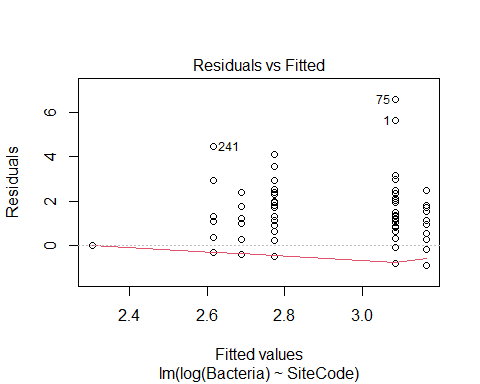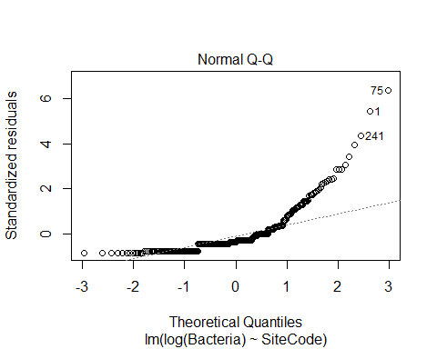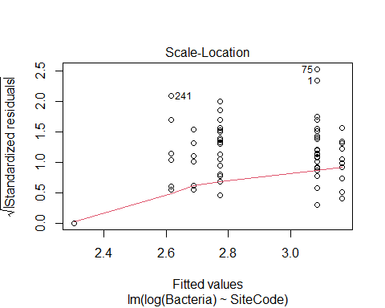
\#\#\#\# Linear in Rainfall

``` r
rain_lm <- lm(log(Bacteria) ~ SiteCode + Rain48, data = recent_data)
plot(rain_lm)
```

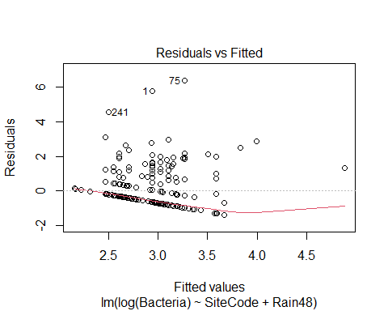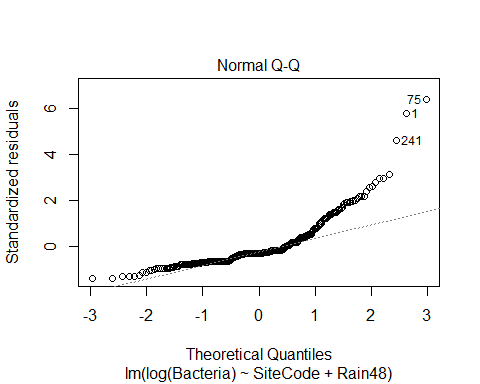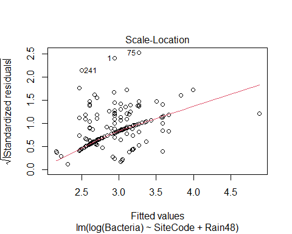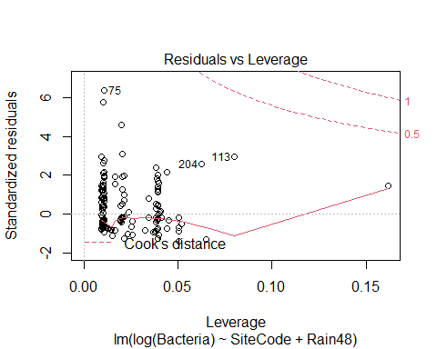

#### Log(rain + 1) model

``` r
lograin_lm <- lm(log(Bacteria) ~ SiteCode + log1p(Rain48), data = recent_data)
plot(lograin_lm)
```

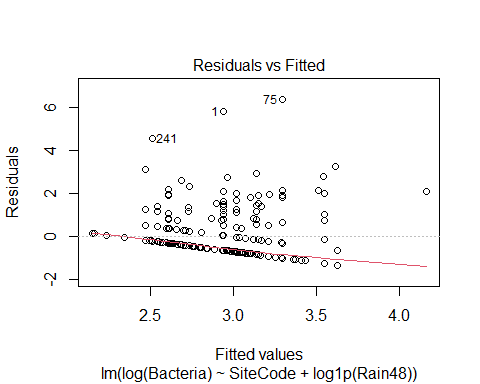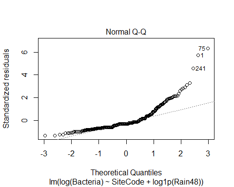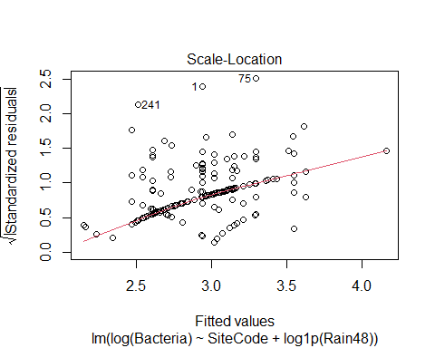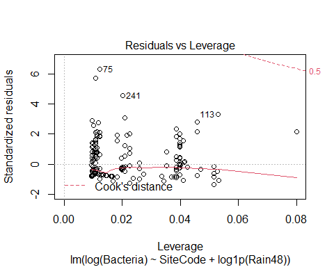

``` r
AIC(rain_lm)
#> [1] 966.4819
AIC(lograin_lm)
#> [1] 971.3015
```

Incorporating a rainfall predictor helps address the extreme outliers.
Sample sizes are moderately large, and model diagnostics show no high
leverage points. However, there is a moderate remaining remaining
relationship between location and scale. We should not take the details
too seriously. The model based on a log transform of rainfall performs
slightly better, but most samples had no recent rainfall.

``` r
anova(lograin_lm)
#> Analysis of Variance Table
#> 
#> Response: log(Bacteria)
#>                Df Sum Sq Mean Sq F value    Pr(>F)    
#> SiteCode        5  19.90  3.9801  3.8766   0.00199 ** 
#> log1p(Rain48)   1  16.41 16.4117 15.9851 7.887e-05 ***
#> Residuals     329 337.78  1.0267                      
#> ---
#> Signif. codes:  0 '***' 0.001 '**' 0.01 '*' 0.05 '.' 0.1 ' ' 1
```

``` r
(emms <- emmeans(lograin_lm, "SiteCode", type = 'response'))
#>  SiteCode response   SE  df lower.CL upper.CL
#>  BC-1         14.2 2.02 329    10.73     18.8
#>  EEB-01       16.3 1.63 329    13.40     19.8
#>  HARP-1       10.3 2.09 329     6.93     15.4
#>  HARP-2       15.3 3.04 329    10.33     22.6
#>  HARP-3       24.6 4.89 329    16.63     36.4
#>  WIL-02       22.8 2.26 329    18.72     27.7
#> 
#> Confidence level used: 0.95 
#> Intervals are back-transformed from the log scale
```

``` r
plot(emms) + 
  xlab('Enteroccocci\n(MPN / 100 ml)') +
  coord_flip() +
  theme(axis.text.x = element_text(angle = 90, vjust = 0.25))
```

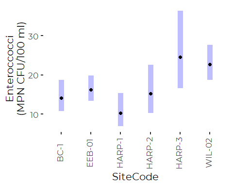

### GLM Analysis

We review a GLMs that can better handle the remaining dependency between
means and variances. The Gamma GLM implies a relationship where the
variance scales as the square of the mean, while the inverse gaussian
implies a relationship where variance scales linearly with the mean. Our
scale-location relationship looks close to linear, but in practice the
inverse gaussian GLMs performed poorly (based on diagnostic plots).

One issue is that both Gamma and Inverse Gaussian models only permit
positive values. Our log transformed data (at least in principal) could
include negative values, if any of our original observations were below
1. That did not happen.

Our original data were quasi-count data, with a positive detection limit
(usually 10, sometimes 1). We prefer to replace non-detects with an
estimate of conditional expected value. In principal, that that value
could be below 1, but that was never the case for our recent data, where
the lower detection limit did not occur.

#### Gamma GLM

``` r
gamma_glm <- glm(log(Bacteria) ~ SiteCode + log1p(Rain48), 
                family = Gamma(), 
                data = recent_data)
```

``` r
boot::glm.diag.plots(gamma_glm)
```

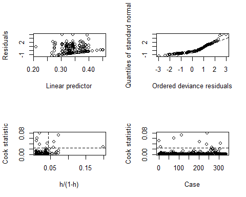
There are a handful of points with high influence, but most have low
leverage. Two or perhaps three points are problematic. We can look at
the points individually.

``` r
pts <- boot::glm.diag(gamma_glm)
pts3 <- which(pts$cook > 0.025 & pts$h / (1 - pts$h) > 0.05)
recent_data[pts3,] %>%
  select(c(SiteCode, sdate, Enterococci, Rain48))
#> # A tibble: 4 x 4
#>   SiteCode sdate      Enterococci Rain48
#>   <chr>    <date>           <dbl>  <dbl>
#> 1 WIL-02   2016-06-06         512   3   
#> 2 EEB-01   2016-06-07         959   2.15
#> 3 EEB-01   2019-08-22         560   1.9 
#> 4 HARP-3   2018-07-18         279   0.75
```

These potentially problematic points are all moderately high bacteria
levels associated with high rainfall events. It is likely that after a
certain level of rainfall triggers runoff, much higher rainfall has
relatively little additional effect on bacteria levels. This suggests we
may have a breakdown in the linear response for higher level rainfall
events, which may cause the model to understate the importance of
rainfal lat lower concentrations. We need to check that.

``` r
(emms <- emmeans(gamma_glm, "SiteCode", type = 'response'))
#>  SiteCode response   SE  df asymp.LCL asymp.UCL
#>  BC-1         13.9 1.73 Inf     10.87      17.7
#>  EEB-01       16.0 1.47 Inf     13.37      19.2
#>  HARP-1       10.1 1.58 Inf      7.44      13.8
#>  HARP-2       15.0 2.70 Inf     10.54      21.3
#>  HARP-3       24.2 5.14 Inf     16.01      36.7
#>  WIL-02       22.4 2.30 Inf     18.30      27.4
#> 
#> Confidence level used: 0.95 
#> Intervals are back-transformed from the log scale
```

The negative lower confidence limits are clearly a problem. The rank
order of predicted values and their approximate values all appear more
or less appropriate, but we have little confidence in the model, and its
strongest result is that sites do not differ in average bacteria levels.

``` r
plot(emms) + 
  xlab('Enteroccocci\n(MPN / 100ml)') +
  coord_flip()
```

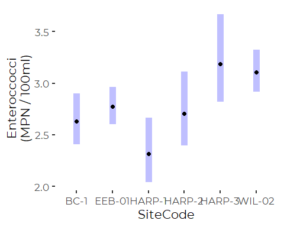

``` r
pwpp(emmeans(gamma_glm, "SiteCode"))
#> Note: Use 'contrast(regrid(object), ...)' to obtain contrasts of back-transformed estimates
```

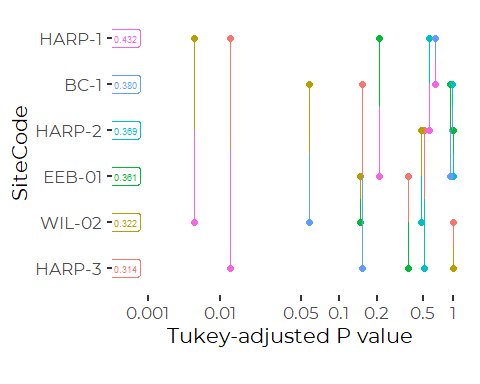

### Binomial Model

``` r
exceeds_glm <- glm(Exceeds ~ SiteCode + Rain48, family = 'binomial', 
                   data = recent_data)
anova(exceeds_glm, test = 'LRT')
#> Analysis of Deviance Table
#> 
#> Model: binomial, link: logit
#> 
#> Response: Exceeds
#> 
#> Terms added sequentially (first to last)
#> 
#> 
#>          Df Deviance Resid. Df Resid. Dev  Pr(>Chi)    
#> NULL                       335     172.92              
#> SiteCode  5   7.5676       330     165.35    0.1817    
#> Rain48    1  16.7358       329     148.62 4.296e-05 ***
#> ---
#> Signif. codes:  0 '***' 0.001 '**' 0.01 '*' 0.05 '.' 0.1 ' ' 1
```

Sites do not differ in the probability of violating instantaneous water
quality standards, but rainfall has a high impact on that probability.

``` r
summary(exceeds_glm)
#> 
#> Call:
#> glm(formula = Exceeds ~ SiteCode + Rain48, family = "binomial", 
#>     data = recent_data)
#> 
#> Deviance Residuals: 
#>     Min       1Q   Median       3Q      Max  
#> -0.9817  -0.3825  -0.3131  -0.2121   2.8027  
#> 
#> Coefficients:
#>                 Estimate Std. Error z value Pr(>|z|)    
#> (Intercept)      -3.9077     0.7925  -4.931 8.19e-07 ***
#> SiteCodeEEB-01    0.7357     0.8401   0.876   0.3812    
#> SiteCodeHARP-1  -15.2018  1263.6380  -0.012   0.9904    
#> SiteCodeHARP-2    0.1246     1.2741   0.098   0.9221    
#> SiteCodeHARP-3    1.7068     0.9398   1.816   0.0693 .  
#> SiteCodeWIL-02    0.9817     0.8379   1.172   0.2413    
#> Rain48            1.7214     0.4365   3.944 8.02e-05 ***
#> ---
#> Signif. codes:  0 '***' 0.001 '**' 0.01 '*' 0.05 '.' 0.1 ' ' 1
#> 
#> (Dispersion parameter for binomial family taken to be 1)
#> 
#>     Null deviance: 172.92  on 335  degrees of freedom
#> Residual deviance: 148.61  on 329  degrees of freedom
#> AIC: 162.61
#> 
#> Number of Fisher Scoring iterations: 17
```

Note the exceptionally high standard error for site Harp-1. No sample
from that site has failed water quality criteria, so the estimation is
unstable.

We repeat the analysis, omitting that site, to improve model
performance.

``` r
exceeds_glm_2<- glm(Exceeds ~ SiteCode + Rain48, family = 'binomial',  
                    data = recent_data,
                    subset = SiteCode != 'HARP-1')
anova(exceeds_glm_2, test = 'LRT')
#> Analysis of Deviance Table
#> 
#> Model: binomial, link: logit
#> 
#> Response: Exceeds
#> 
#> Terms added sequentially (first to last)
#> 
#> 
#>          Df Deviance Resid. Df Resid. Dev  Pr(>Chi)    
#> NULL                       310     169.06              
#> SiteCode  4   3.7113       306     165.35    0.4465    
#> Rain48    1  16.7358       305     148.62 4.296e-05 ***
#> ---
#> Signif. codes:  0 '***' 0.001 '**' 0.01 '*' 0.05 '.' 0.1 ' ' 1
```

That does not alter our conclusions.

# Trend Analysis

We have trouble conducting trend analysis that includes rainfall
information, as the way rainfall and weather data were collected
changed.

``` r
beach_data %>%
  group_by(Year) %>%
  summarize(n_Rain24 = sum(! is.na(Rain24)),
            n_Rain48 = sum(! is.na(Rain48)))
#> # A tibble: 20 x 3
#>     Year n_Rain24 n_Rain48
#>    <dbl>    <int>    <int>
#>  1  2000        0        0
#>  2  2001        0        0
#>  3  2002        0        0
#>  4  2003       97        0
#>  5  2004      101        0
#>  6  2005       78        0
#>  7  2006      101        0
#>  8  2007      107        0
#>  9  2008        0      133
#> 10  2009        0      139
#> 11  2010        0      149
#> 12  2011        0       44
#> 13  2012        0       50
#> 14  2013        0       77
#> 15  2014        0       74
#> 16  2015        0       76
#> 17  2016        0       68
#> 18  2017        0       61
#> 19  2018        0      101
#> 20  2019        0      106
```

Consistent rain information has been collected since 2008, based on rain
in the prior 48 hours.

``` r
trend_data <- beach_data %>%
  filter(SiteCode == 'WIL-02' | SiteCode == 'EEB-01') %>%
  filter(! is.na(Bacteria2)) %>%
  filter(Year > 2007)
```

## Log Linear Model

``` r
trend_lm <- lm(log(Bacteria) ~ Beach * Year + log1p(Rain48), data = trend_data)
anova(trend_lm)
#> Analysis of Variance Table
#> 
#> Response: log(Bacteria)
#>                Df Sum Sq Mean Sq  F value  Pr(>F)    
#> Beach           1  11.39  11.391   8.7212 0.00325 ** 
#> Year            1   4.05   4.053   3.1033 0.07857 .  
#> log1p(Rain48)   1 257.53 257.529 197.1607 < 2e-16 ***
#> Beach:Year      1   0.29   0.291   0.2226 0.63717    
#> Residuals     708 924.78   1.306                     
#> ---
#> Signif. codes:  0 '***' 0.001 '**' 0.01 '*' 0.05 '.' 0.1 ' ' 1
```

So, when accounting for severity of recent rainfall, there is a
marginally significant long term trend.

``` r
summary(trend_lm)
#> 
#> Call:
#> lm(formula = log(Bacteria) ~ Beach * Year + log1p(Rain48), data = trend_data)
#> 
#> Residuals:
#>     Min      1Q  Median      3Q     Max 
#> -3.4892 -0.6203 -0.3410  0.4743  6.0335 
#> 
#> Coefficients:
#>                          Estimate Std. Error t value Pr(>|t|)    
#> (Intercept)              30.70794   33.49660   0.917    0.360    
#> BeachWillard Beach      -23.67348   50.78954  -0.466    0.641    
#> Year                     -0.01395    0.01664  -0.838    0.402    
#> log1p(Rain48)             1.75237    0.12479  14.043   <2e-16 ***
#> BeachWillard Beach:Year   0.01190    0.02523   0.472    0.637    
#> ---
#> Signif. codes:  0 '***' 0.001 '**' 0.01 '*' 0.05 '.' 0.1 ' ' 1
#> 
#> Residual standard error: 1.143 on 708 degrees of freedom
#>   (17 observations deleted due to missingness)
#> Multiple R-squared:  0.2281, Adjusted R-squared:  0.2237 
#> F-statistic:  52.3 on 4 and 708 DF,  p-value: < 2.2e-16
```

``` r
year_trends <- emtrends(trend_lm, ~ Beach, var = "Year", cov.reduce = median)
year_trends
#>  Beach          Year.trend     SE  df lower.CL upper.CL
#>  East End Beach   -0.01395 0.0166 708  -0.0466   0.0187
#>  Willard Beach    -0.00205 0.0190 708  -0.0394   0.0353
#> 
#> Confidence level used: 0.95
```

``` r
emmip(trend_lm, Beach ~ Year, variable = 'Year', type = 'response', 
      cov.reduce = median,
      at = list(Year = 2008:2019), CIs = TRUE) +
  theme_cbep()
```

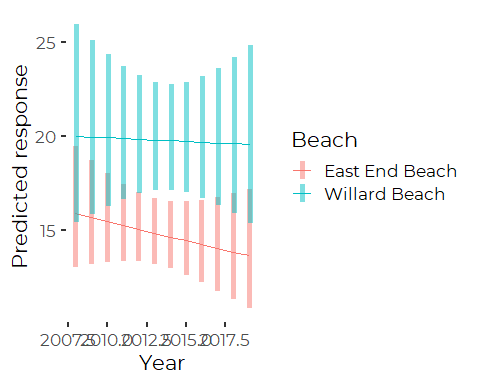

## Gamma GLM

``` r
trend_glm <- glm(log(Bacteria2) ~ Beach * Year + log1p(Rain48), 
                 family = Gamma(),
                 data = trend_data)
anova(trend_glm, test = 'LRT')
#> Analysis of Deviance Table
#> 
#> Model: Gamma, link: inverse
#> 
#> Response: log(Bacteria2)
#> 
#> Terms added sequentially (first to last)
#> 
#> 
#>               Df Deviance Resid. Df Resid. Dev  Pr(>Chi)    
#> NULL                            712     224.88              
#> Beach          1    2.257       711     222.62  0.004105 ** 
#> Year           1    1.080       710     221.54  0.047102 *  
#> log1p(Rain48)  1   34.432       709     187.11 < 2.2e-16 ***
#> Beach:Year     1    0.257       708     186.85  0.333162    
#> ---
#> Signif. codes:  0 '***' 0.001 '**' 0.01 '*' 0.05 '.' 0.1 ' ' 1
```

Here, we see a statistically significant long term trend, but no
differences in the trend between the two beaches. And that "trend is
fairly weak, and vanishes as you look more closely.

``` r
summary(trend_glm)
#> 
#> Call:
#> glm(formula = log(Bacteria2) ~ Beach * Year + log1p(Rain48), 
#>     family = Gamma(), data = trend_data)
#> 
#> Deviance Residuals: 
#>      Min        1Q    Median        3Q       Max  
#> -1.46233  -0.57477  -0.06861   0.28872   1.51365  
#> 
#> Coefficients:
#>                          Estimate Std. Error t value Pr(>|t|)    
#> (Intercept)             -6.221247   5.721304  -1.087    0.277    
#> BeachWillard Beach       7.829071   8.153312   0.960    0.337    
#> Year                     0.003308   0.002842   1.164    0.245    
#> log1p(Rain48)           -0.167798   0.012058 -13.916   <2e-16 ***
#> BeachWillard Beach:Year -0.003914   0.004050  -0.966    0.334    
#> ---
#> Signif. codes:  0 '***' 0.001 '**' 0.01 '*' 0.05 '.' 0.1 ' ' 1
#> 
#> (Dispersion parameter for Gamma family taken to be 0.2739711)
#> 
#>     Null deviance: 224.88  on 712  degrees of freedom
#> Residual deviance: 186.85  on 708  degrees of freedom
#>   (17 observations deleted due to missingness)
#> AIC: 2333.3
#> 
#> Number of Fisher Scoring iterations: 5
```

``` r
emtrends(trend_glm, ~ Beach, 
         var = "Year", 
         at = list(Rain48 = 0))
#>  Beach          Year.trend      SE  df asymp.LCL asymp.UCL
#>  East End Beach   0.003308 0.00284 Inf  -0.00226   0.00888
#>  Willard Beach   -0.000607 0.00293 Inf  -0.00635   0.00514
#> 
#> Results are given on the log (not the response) scale. 
#> Confidence level used: 0.95
```

Note that both of those marginal trends are not statistically
significant on their own.
