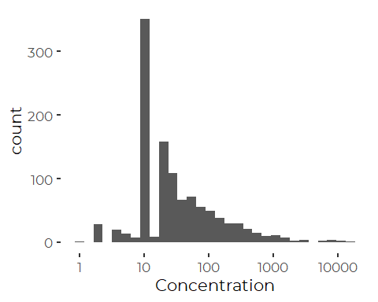
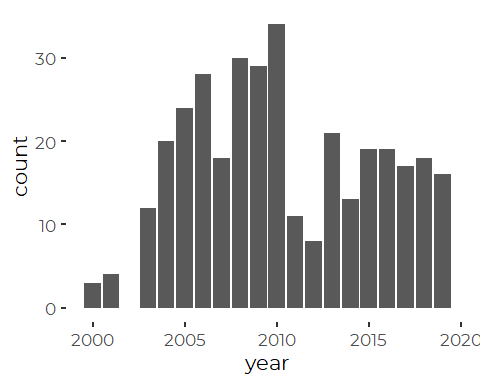
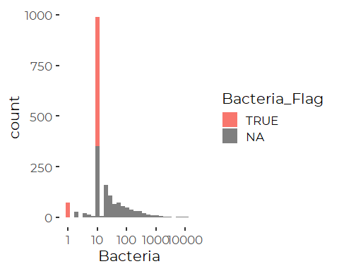
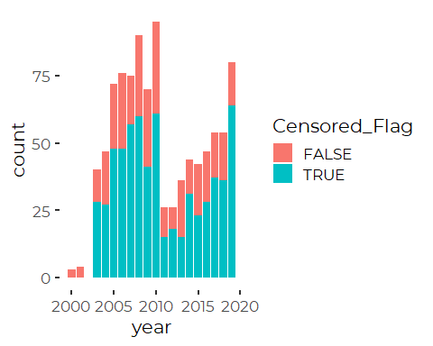
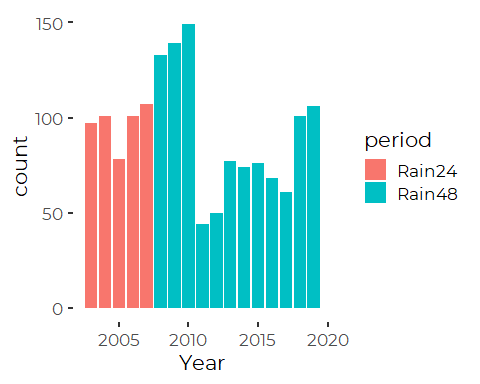

Preparation of data on Bacteria Levels at Casco Bay Beaches
================
Curtis C. Bohlen, Casco Bay Estuary Partnership.
01/23/2021

-   [Introduction](#introduction)
-   [Import Libraries](#import-libraries)
-   [Data Preparation](#data-preparation)
    -   [Initial Folder References](#initial-folder-references)
    -   [Load Data](#load-data)
    -   [Drop MDL](#drop-mdl)
    -   [Rename Columns](#rename-columns)
    -   [Add Date and Time Values](#add-date-and-time-values)
-   [Minimum Values and Left Censored
    Values](#minimum-values-and-left-censored-values)
    -   [Histogram](#histogram)
    -   [Observation at Lower Observation
        Limit](#observation-at-lower-observation-limit)
    -   [Incorporating Non-detects](#incorporating-non-detects)
    -   [Reviewing Contents](#reviewing-contents)
-   [Pivoting the data](#pivoting-the-data)
    -   [Measured Variables](#measured-variables)
        -   [Add Date and Time Values](#add-date-and-time-values-1)
    -   [Qualitative Weather and Environmental
        Data](#qualitative-weather-and-environmental-data)
        -   [Add Date and Time Values](#add-date-and-time-values-2)
        -   [Check for Duplicate Rows](#check-for-duplicate-rows)
    -   [Final Data Join](#final-data-join)
-   [Data Review](#data-review)
    -   [Check 24 hour and 48 Hour Rainfall
        Totals](#check-24-hour-and-48-hour-rainfall-totals)
    -   [Check Related](#check-related)
    -   [What’s in the Data?](#whats-in-the-data)
-   [Export Data](#export-data)


# Introduction

# Import Libraries

``` r
library(tidyverse)
#> -- Attaching packages --------------------------------------- tidyverse 1.3.0 --
#> v ggplot2 3.3.3     v purrr   0.3.4
#> v tibble  3.0.5     v dplyr   1.0.3
#> v tidyr   1.1.2     v stringr 1.4.0
#> v readr   1.4.0     v forcats 0.5.0
#> -- Conflicts ------------------------------------------ tidyverse_conflicts() --
#> x dplyr::filter() masks stats::filter()
#> x dplyr::lag()    masks stats::lag()
library(readxl)

library(CBEPgraphics)
load_cbep_fonts()
theme_set(theme_cbep())

library(LCensMeans)
```

# Data Preparation

## Initial Folder References

``` r
sibfldnm    <- 'Original_Data'
parent      <- dirname(getwd())
sibling     <- file.path(parent,sibfldnm)

#dir.create(file.path(getwd(), 'figures'), showWarnings = FALSE)
#dir.create(file.path(getwd(), 'models'),  showWarnings = FALSE)
```

## Load Data

``` r
fn <- "CascoBay_StateOfTheBay_DataRequest 04152020.xlsx"

raw_data <- read_excel(file.path(sibling, fn), 
                       sheet = "Data",
                       #range = cell_rows(1:1000),  # used to test col_types
                       col_types = c("text", "skip", "date", "text", 
                                   "text", "skip", "text", "numeric",    #h
                                   "text", "text", "numeric", "text", 
                                   "skip", "skip", "skip", "skip",       #p
                                   "skip", "skip", "skip", "skip", 
                                   "numeric", "skip", "numeric", "skip", #x
                                   "skip",  "skip",                      #z
                                   "skip", "skip", 
                                   "skip", "skip", "skip", "text", 
                                   "text"),
                       .name_repair = 'universal') 
#> New names:
#> * `Sample Point Name` -> Sample.Point.Name
#> * `Sample Date` -> Sample.Date
#> * `Sample Id` -> Sample.Id
#> * `Sample Type` -> Sample.Type
#> * `CAS Name` -> CAS.Name
#> * ...
```

``` r
names(raw_data)
#>  [1] "Sample.Point.Name"     "Sample.Date"           "Sample.Id"            
#>  [4] "Sample.Type"           "CAS.Name"              "Concentration"        
#>  [7] "Parameter.Unit"        "Lab.Qualifier"         "Reporting.Limit"      
#> [10] "Test.Code"             "Dilution.Factor"       "MDL"                  
#> [13] "Sample.Type.Qualifier" "Comment"
```

## Drop MDL

MDL and Reporting Limit are near duplicates. Where they do not match, it
is because MDL is missing (`NA`), so we use Reporting Limits

``` r
raw_data %>%
  mutate(Reporting.Limit = replace_na(Reporting.Limit, -1),
         MDL =  replace_na(MDL, -1)) %>%
  filter(Reporting.Limit != MDL)
#> # A tibble: 434 x 14
#>    Sample.Point.Na~ Sample.Date         Sample.Id Sample.Type CAS.Name
#>    <chr>            <dttm>              <chr>     <chr>       <chr>   
#>  1 WIL-01           2010-06-14 09:33:00 WIL-01 6~ SURFACE WA~ ENTEROC~
#>  2 WIL-01           2010-06-16 09:32:00 WIL-01 6~ SURFACE WA~ ENTEROC~
#>  3 WIL-01           2010-06-02 09:30:00 WIL-01 6~ SURFACE WA~ ENTEROC~
#>  4 WIL-01           2010-06-21 09:30:00 WIL-01 6~ SURFACE WA~ ENTEROC~
#>  5 WIL-01           2010-06-23 09:17:00 WIL-01 6~ SURFACE WA~ ENTEROC~
#>  6 WIL-01           2010-06-24 11:00:00 WIL-01 6~ SURFACE WA~ ENTEROC~
#>  7 WIL-01           2010-06-28 09:49:00 WIL-01 6~ SURFACE WA~ ENTEROC~
#>  8 WIL-01           2010-06-29 12:27:00 WIL-01 6~ SURFACE WA~ ENTEROC~
#>  9 WIL-01           2010-06-30 09:35:00 WIL-01 6~ SURFACE WA~ ENTEROC~
#> 10 WIL-01           2010-06-07 09:24:00 WIL-01 6~ SURFACE WA~ ENTEROC~
#> # ... with 424 more rows, and 9 more variables: Concentration <dbl>,
#> #   Parameter.Unit <chr>, Lab.Qualifier <chr>, Reporting.Limit <dbl>,
#> #   Test.Code <chr>, Dilution.Factor <dbl>, MDL <dbl>,
#> #   Sample.Type.Qualifier <chr>, Comment <chr>
```

``` r
raw_data <- raw_data %>%
  select(-MDL)
```

## Rename Columns

``` r
raw_data <- raw_data %>%
  rename(SiteCode = Sample.Point.Name,
         sdatetime = Sample.Date,
         Parameter = CAS.Name,
         Units = Parameter.Unit,
         Sample.Qual = Sample.Type.Qualifier
         )
```

## Add Date and Time Values

``` r
raw_data <- raw_data %>%
  mutate(Year = as.numeric(format(sdatetime, format = '%Y')),
         Month = as.numeric(format(sdatetime, format = '%m')),
         DOY = as.numeric(format(sdatetime, format = '%j')),
         sdate = as.Date(sdatetime))
```

Note: Sample\_Type may not be essential here – it only has three values,
`NA`, “NOT APPLICABLE”, and “REANALYSIS”. Probably only “REANALYSIS” is
meaningful.

# Minimum Values and Left Censored Values

It is a bit unclear which observations are left censored.

The enterococci data is sometimes blank, with a “Lab Qualifier” = “U”.
These appear to be conventional “non-detects”.

There are also a fairly high number of samples, where the reported
concentration equals the reporting limit.

## Histogram

``` r
raw_data %>%
  filter(Parameter == 'ENTEROCOCCI') %>%
ggplot(aes(Concentration)) +
  geom_histogram() +
  scale_x_log10()
#> `stat_bin()` using `bins = 30`. Pick better value with `binwidth`.
#> Warning: Removed 709 rows containing non-finite values (stat_bin).
```



The MPN method does not provide actual number of colony forming units,
but “average numbers” based on the method. MPSN produces “interval
censored” data, a fact that we can usually ignore, but here it
emphasizes the uncertainty at the low end of observed bacteria
concentrations.

It is not unreasonable to think the peak at 10 reflects pooled values
near the reporting limit. That reporting limit is either 1 or 10, and
corresponds to the Dilution Factor. MPN methods return unevenly spaced
values starting at 1, 2…. so if those results are multiplied by 10 (to
account for the dilution) that generates 10,20…. So the large number of
values at 10 are essentially synonymous with something like “detected,
but at less than 20”.

## Observation at Lower Observation Limit

``` r
raw_data %>%
  mutate(year = as.numeric(format(sdatetime, format = '%Y'))) %>% 
  filter(Parameter == 'ENTEROCOCCI') %>%
  filter(Concentration == 10) %>%
  select(Concentration, year) %>%
  ggplot(aes(x = year)) + 
  geom_bar()
```



So those samples with nominal value of 10 occur throughout the record,
and are unlikely to be censored values coded differently during a
certain period of time. We therefore take the data at face value, and
use it as-is.

## Incorporating Non-detects

Our methods for addressing non-detects in `LCensMeans` requires data in
a different format. It requires data in one column, with a separate
logical vector indicating which observations were censored. Here, we
create a simplified data set to examine. We will need to repeat this
process later.

``` r
cens_data <- raw_data %>%
  filter(Parameter == 'ENTEROCOCCI') %>%
  mutate(Bacteria = if_else((! is.na(Lab.Qualifier)) & Lab.Qualifier == 'U',
                                    Reporting.Limit,
                                    Concentration),
         Censored_Flag = Lab.Qualifier == 'U',
         Censored_Flag = replace_na(Censored_Flag, FALSE))
```

``` r
cens_data %>%
ggplot(aes(Bacteria, fill = Censored_Flag)) +
  geom_histogram() +
  scale_x_log10()
#> `stat_bin()` using `bins = 30`. Pick better value with `binwidth`.
```



``` r
cens_data %>%
  mutate(year = as.numeric(format(sdatetime, format = '%Y'))) %>% 
  filter(Bacteria == 10) %>%
  ggplot(aes(x = year, fill = Censored_Flag)) + 
  geom_bar() #aes(fill = Censored_Flag))
```


It is interesting that value 10 detects and the number of non-detects
appear related.

``` r
rm(cens_data)
```

## Reviewing Contents

``` r
xtabs(~ Parameter + Sample.Type, data = raw_data)
#>                                Sample.Type
#> Parameter                        AIR PHYSICAL CHARACTERISTIC RAIN PRECIPITATION
#>   ACCUMULATION LAST 24 HOURS       0                       0                484
#>   ACCUMULATION LAST 48 HOURS       0                       0               1078
#>   CURRENT WEATHER CLEAR            0                     841                  0
#>   CURRENT WEATHER OVERCAST         0                     412                  0
#>   CURRENT WEATHER PARTLY CLOUDY    0                     378                  0
#>   CURRENT WEATHER RAIN             0                     155                  0
#>   DAYS OF SIMILAR WEATHER          0                    1521                  0
#>   ENTEROCOCCI                      0                       0                  0
#>   PAST 24HR WEATHER HEAVY RAIN     0                      20                  0
#>   PAST 24HR WEATHER LIGHT RAIN     0                     123                  0
#>   PAST 24HR WEATHER MEDIUM RAIN    0                      80                  0
#>   PAST 48HR WEATHER HEAVY RAIN     0                     126                  0
#>   PAST 48HR WEATHER LIGHT RAIN     0                     304                  0
#>   PAST 48HR WEATHER MEDIUM RAIN    0                     171                  0
#>   PAST 48HR WEATHER NO RAIN        0                     294                  0
#>   RESULT AVAILABLE                 0                     663                  0
#>   SALINITY (FROM SODIUM)           0                       0                  0
#>   SAMPLE DEPTH INTERVAL BOTTOM     0                       0                  0
#>   SAMPLE DEPTH INTERVAL TOP        0                       0                  0
#>   TEMPERATURE                   1631                       0                  0
#>   TIDE STAGE: EBB                  0                     415                  0
#>   TIDE STAGE: FLOOD                0                     476                  0
#>   TIDE STAGE: HIGH                 0                     169                  0
#>   TIDE STAGE: HIGH EBB             0                     137                  0
#>   TIDE STAGE: HIGH FLOOD           0                     165                  0
#>   TIDE STAGE: LOW                  0                     143                  0
#>   TIDE STAGE: LOW EBB              0                     129                  0
#>   TIDE STAGE: LOW FLOOD            0                     117                  0
#>   WATER SURFACE CALM               0                    1324                  0
#>   WATER SURFACE MEDIUM CURRENT     0                     447                  0
#>   WATER SURFACE RAPID CURRENT      0                      18                  0
#>   WATER SURFACE ROUGH              0                     104                  0
#>   WATER SURFACE SLOW CURRENT       0                    1063                  0
#>                                Sample.Type
#> Parameter                       SURFACE WATER
#>   ACCUMULATION LAST 24 HOURS                0
#>   ACCUMULATION LAST 48 HOURS                0
#>   CURRENT WEATHER CLEAR                     0
#>   CURRENT WEATHER OVERCAST                  0
#>   CURRENT WEATHER PARTLY CLOUDY             0
#>   CURRENT WEATHER RAIN                      0
#>   DAYS OF SIMILAR WEATHER                   0
#>   ENTEROCOCCI                            1822
#>   PAST 24HR WEATHER HEAVY RAIN              0
#>   PAST 24HR WEATHER LIGHT RAIN              0
#>   PAST 24HR WEATHER MEDIUM RAIN             0
#>   PAST 48HR WEATHER HEAVY RAIN              0
#>   PAST 48HR WEATHER LIGHT RAIN              0
#>   PAST 48HR WEATHER MEDIUM RAIN             0
#>   PAST 48HR WEATHER NO RAIN                 0
#>   RESULT AVAILABLE                          0
#>   SALINITY (FROM SODIUM)                 1594
#>   SAMPLE DEPTH INTERVAL BOTTOM            816
#>   SAMPLE DEPTH INTERVAL TOP               816
#>   TEMPERATURE                            1737
#>   TIDE STAGE: EBB                           0
#>   TIDE STAGE: FLOOD                         0
#>   TIDE STAGE: HIGH                          0
#>   TIDE STAGE: HIGH EBB                      0
#>   TIDE STAGE: HIGH FLOOD                    0
#>   TIDE STAGE: LOW                           0
#>   TIDE STAGE: LOW EBB                       0
#>   TIDE STAGE: LOW FLOOD                     0
#>   WATER SURFACE CALM                        0
#>   WATER SURFACE MEDIUM CURRENT              0
#>   WATER SURFACE RAPID CURRENT               0
#>   WATER SURFACE ROUGH                       0
#>   WATER SURFACE SLOW CURRENT                0
```

# Pivoting the data

We need to pivot multiple data columns in parallel, at least until we
are sure we don’t need some of these columns:

## Measured Variables

We have a problem with temperature data, as the parameter is used both
for air and water temp. We modify as follows, before pivoting.

``` r
raw_data <- raw_data %>%
  mutate(Parameter  = if_else(Parameter == 'TEMPERATURE' & Sample.Type == 'AIR',
                              'AIR TEMPERATURE', Parameter))
```

``` r
wide_data <- raw_data %>%
  filter(! startsWith(Sample.Type, 'PHYSICAL'))  %>%
  filter(Parameter != 'RESULT AVAILABLE') %>%
  select(-Sample.Type) %>%
  pivot_wider(starts_with('S'), names_from = Parameter,
              values_from = c(Concentration, Lab.Qualifier, Reporting.Limit)) %>%
  
  rename(LQ = Lab.Qualifier_ENTEROCOCCI ) %>%
  select (-starts_with('LAB.QUALIFIER')) %>%
  rename(Lab.Qualifier = LQ) %>%
  
  rename(RL = Reporting.Limit_ENTEROCOCCI ) %>%
  select (-starts_with('Reporting.Limit')) %>%
  rename(Reporting.Limit = RL) %>%
  
  select(-contains('DEPTH')) %>%
  
  rename_with(~ sub('Concentration_', '', .x )) %>%
  
  mutate(Bacteria = if_else((! is.na(Lab.Qualifier)) & Lab.Qualifier == 'U',
                                    Reporting.Limit,
                                    ENTEROCOCCI),
         Censored_Flag = Lab.Qualifier == 'U',
         Censored_Flag = replace_na(Censored_Flag, FALSE)) %>%
  
  rename(Enterococci = ENTEROCOCCI,
         Salinity = `SALINITY (FROM SODIUM)`,
         Air_Temp = `AIR TEMPERATURE`,
         Water_Temp = TEMPERATURE,
         Rain24  = `ACCUMULATION LAST 24 HOURS`,
         Rain48 = `ACCUMULATION LAST 48 HOURS`
         ) 
```

### Add Date and Time Values

``` r
wide_data <- wide_data %>%
  mutate(Year = as.numeric(format(sdatetime, format = '%Y')),
         Month = as.numeric(format(sdatetime, format = '%m')),
         DOY = as.numeric(format(sdatetime, format = '%j')),
         sdate = as.Date(sdatetime))
```

## Qualitative Weather and Environmental Data

We have a problem with qualitative data,as they are coded as a series of
flags, which need to be interpreted and regrouped into factors.

``` r
context_data <- raw_data %>%
  filter(startsWith(Sample.Type, 'PHYSICAL')) %>%
  select(-Sample.Type) %>%
select(-c(Lab.Qualifier:Comment))
```

``` r
xtabs(~ Parameter + Units, data = context_data)
#>                                Units
#> Parameter                         CT TRUE/FALSE
#>   CURRENT WEATHER CLEAR            0        841
#>   CURRENT WEATHER OVERCAST         0        412
#>   CURRENT WEATHER PARTLY CLOUDY    0        378
#>   CURRENT WEATHER RAIN             0        155
#>   DAYS OF SIMILAR WEATHER       1521          0
#>   PAST 24HR WEATHER HEAVY RAIN     0         20
#>   PAST 24HR WEATHER LIGHT RAIN     0        123
#>   PAST 24HR WEATHER MEDIUM RAIN    0         80
#>   PAST 48HR WEATHER HEAVY RAIN     0        126
#>   PAST 48HR WEATHER LIGHT RAIN     0        304
#>   PAST 48HR WEATHER MEDIUM RAIN    0        171
#>   PAST 48HR WEATHER NO RAIN        0        294
#>   RESULT AVAILABLE                 0        663
#>   TIDE STAGE: EBB                  0        415
#>   TIDE STAGE: FLOOD                0        476
#>   TIDE STAGE: HIGH                 0        169
#>   TIDE STAGE: HIGH EBB             0        137
#>   TIDE STAGE: HIGH FLOOD           0        165
#>   TIDE STAGE: LOW                  0        143
#>   TIDE STAGE: LOW EBB              0        129
#>   TIDE STAGE: LOW FLOOD            0        117
#>   WATER SURFACE CALM               0       1324
#>   WATER SURFACE MEDIUM CURRENT     0        447
#>   WATER SURFACE RAPID CURRENT      0         18
#>   WATER SURFACE ROUGH              0        104
#>   WATER SURFACE SLOW CURRENT       0       1063
```

We want to group these physical observations (currently coded as
“TRUE/FALSE” values for each indicator) back into FACTORS. This is
laborious, but conceptually simple. However, we are also generating a
LOT of NAs that will have to be cleaned up later.

``` r
context_data_2 <- context_data %>%
  mutate(Weather = if_else(grepl('CURRENT WEATHER', Parameter),
                           sub('CURRENT WEATHER ', '', Parameter),
                           NA_character_)) %>%
  mutate(Weather = factor(Weather, levels = c('CLEAR', 'PARTLY CLOUDY', 
                                              'OVERCAST', 'RAIN'))) %>%
  
  
  mutate(Past24HR_Weather = if_else(grepl('PAST 24HR', Parameter),
                                    sub('PAST 24HR WEATHER ', '', Parameter),
                                    NA_character_)) %>%
  mutate(Past24HR_Weather = factor(Past24HR_Weather, 
                                   levels = c('HEAVY RAIN', 
                                              'MEDIUM RAIN',
                                              'LIGHT RAIN'))) %>%
  
  
  mutate(Past48HR_Weather = if_else(grepl('PAST 48HR', Parameter),
                                    sub('PAST 48HR WEATHER ', '', Parameter),
                                    NA_character_)) %>%
  mutate(Past24HR_Weather = factor(Past24HR_Weather,
                                   levels = c('HEAVY RAIN', 
                                              'MEDIUM RAIN',
                                              'LIGHT RAIN', 
                                              'NO RAIN'))) %>%
  
  
  mutate(Tide_Stage = if_else(grepl('TIDE STAGE', Parameter),
                              sub('TIDE STAGE: ', '', Parameter),
                              NA_character_)) %>%
  mutate(Tide_Stage = factor(Tide_Stage, 
                             levels = c('HIGH',
                                        'HIGH EBB',
                                        'EBB',
                                        'LOW EBB',
                                        'LOW',
                                        'LOW FLOOD', 
                                        'FLOOD',
                                        'HIGH FLOOD'))) %>%
  
  
  mutate(Water_Surface = if_else(grepl('WATER SURFACE', Parameter) &
                                   ! grepl('CURRENT', Parameter),
                                 sub('WATER SURFACE ', '', Parameter),
                                 NA_character_)) %>%
  mutate(Tide_Stage = factor(Tide_Stage, levels = c('CALM',
                                                    'ROUGH'))) %>%
  
  
  mutate(Current = if_else(grepl('CURRENT', Parameter),
                           sub('WATER SURFACE ', '', Parameter),
                           NA_character_)) %>%
  mutate(Current = factor(Tide_Stage,
                          levels = c('SLOW CURRENT',
                                     'MEDIUM CURRENT',
                                     'RAPID CURRENT'), 
                          labels = c('SLOW',
                                     'MEDIUM',
                                     'RAPID')))
```

Now we need to clean up all those NAs, and aggregate into nice rows. We
handle the columns one by one, and join back together by Sample ID.

-   Weather  
-   Past24HR\_Weather  
-   Past48HR\_Weather  
-   Tide\_Stage  
-   Water\_Surface  
-   Current

``` r
wthr <- context_data_2 %>%
  filter (! is.na(Weather)) %>%
  select(SiteCode:Sample.Id, Weather)

past24 <- context_data_2 %>%
  filter (! is.na(Past24HR_Weather)) %>%
  select(SiteCode:Sample.Id, Past24HR_Weather)

past48 <- context_data_2 %>%
  filter (! is.na(Past48HR_Weather)) %>%
  select(SiteCode:Sample.Id, Past48HR_Weather)

tide <- context_data_2 %>%
  filter (! is.na(Tide_Stage)) %>%
  select(SiteCode:Sample.Id, Tide_Stage)

surface <- context_data_2 %>%
  filter (! is.na(Water_Surface)) %>%
  select(SiteCode:Sample.Id, Water_Surface)

current <- context_data_2 %>%
  filter (! is.na(Current)) %>%
  select(SiteCode:Sample.Id, Current)

context_data_final <- full_join(wthr, past24,
                                by=c('SiteCode', 'sdatetime', 'Sample.Id')) %>%
  full_join(past48, by=c('SiteCode', 'sdatetime', 'Sample.Id')) %>%
  full_join(tide, by=c('SiteCode', 'sdatetime', 'Sample.Id')) %>%
  full_join(surface, by=c('SiteCode', 'sdatetime', 'Sample.Id')) %>%
  full_join(current, by=c('SiteCode', 'sdatetime', 'Sample.Id'))

rm(wthr, past24, past48, tide, surface, current)       
```

``` r
rm(context_data, context_data_2)
```

### Add Date and Time Values

``` r
context_data_final <- context_data_final %>%
  mutate(Year = as.numeric(format(sdatetime, format = '%Y')),
         Month = as.numeric(format(sdatetime, format = '%m')),
         DOY = as.numeric(format(sdatetime, format = '%j')),
         sdate = as.Date(sdatetime))
```

### Check for Duplicate Rows

Did that generate any duplicate rows (we should not have any)?

``` r
dups <- context_data_final %>%
  group_by(Sample.Id) %>%
  summarize(n = n()) %>%
  filter(n > 1) %>%
  pull(Sample.Id)
dups 
#> [1] "EEB-01 7/11/2003" "EEB-01 8/6/2007"  "WIL-02 6/16/2005" "WIL-02 7/15/2004"
#> [5] "WIL-03 6/16/2005" "WIL-03 7/15/2004"
```

``` r
context_data_final %>%
  filter(Sample.Id %in% dups)
#> # A tibble: 12 x 13
#>    SiteCode sdatetime           Sample.Id Weather Past24HR_Weather
#>    <chr>    <dttm>              <chr>     <fct>   <fct>           
#>  1 WIL-02   2005-06-16 00:00:00 WIL-02 6~ OVERCA~ <NA>            
#>  2 WIL-02   2005-06-16 12:40:00 WIL-02 6~ OVERCA~ <NA>            
#>  3 WIL-02   2004-07-15 00:00:00 WIL-02 7~ CLEAR   <NA>            
#>  4 WIL-02   2004-07-15 14:25:00 WIL-02 7~ CLEAR   <NA>            
#>  5 WIL-03   2005-06-16 00:00:00 WIL-03 6~ OVERCA~ <NA>            
#>  6 WIL-03   2005-06-16 12:45:00 WIL-03 6~ OVERCA~ <NA>            
#>  7 WIL-03   2004-07-15 00:00:00 WIL-03 7~ CLEAR   <NA>            
#>  8 WIL-03   2004-07-15 14:30:00 WIL-03 7~ CLEAR   <NA>            
#>  9 EEB-01   2003-07-11 00:00:00 EEB-01 7~ CLEAR   <NA>            
#> 10 EEB-01   2003-07-11 07:35:00 EEB-01 7~ CLEAR   <NA>            
#> 11 EEB-01   2007-08-06 00:00:00 EEB-01 8~ OVERCA~ <NA>            
#> 12 EEB-01   2007-08-06 11:10:00 EEB-01 8~ OVERCA~ <NA>            
#> # ... with 8 more variables: Past48HR_Weather <chr>, Tide_Stage <fct>,
#> #   Water_Surface <chr>, Current <fct>, Year <dbl>, Month <dbl>, DOY <dbl>,
#> #   sdate <date>
```

Each of these appears to be duplication of weather data, where the same
data is repeated once with a time stamp with an actual time, and a
second time with a time stamp for 0.00 hours. We can delete the rows
with uninformative time stamps, although there is a question of why
those responses are present at all.

``` r
context_data_final <- context_data_final %>%
  mutate(h = as.numeric(format(sdatetime, format = '%H')),
         m = as.numeric(format(sdatetime, format = '%M'))) %>%
filter(! (Sample.Id %in% dups & h == 0 & m == 0)) %>%
  select(-h, -m)
```

Note that we have different numbers of rows in wide\_data and
context\_data\_final.

Lets look at differences.

``` r
context_ids <- context_data_final %>%
  pull(Sample.Id) %>%
  unique

wide_ids <- wide_data %>%
  pull(Sample.Id) %>%
  unique

(context_not_wide <- context_ids[! context_ids %in% wide_ids])
#>  [1] "WIL-01 6/23/2004" "WIL-01 6/30/2004" "WIL-01 6/6/2007"  "WIL-01 7/29/2004"
#>  [5] "WIL-01 7/6/2007"  "WIL-01 8/18/2006" "WIL-01 8/6/2003"  "WIL-02 6/10/2003"
#>  [9] "WIL-02 7/21/2005" "WIL-02 7/26/2005" "WIL-02 7/6/2007"  "WIL-03 6/10/2003"
#> [13] "WIL-03 6/23/2004" "WIL-03 6/30/2004" "WIL-03 7/21/2005" "WIL-03 7/26/2005"
#> [17] "WIL-03 7/29/2004" "WIL-03 8/18/2006" "WIL-03 8/6/2003"
cat('\n\n')
(wide_not_context <- wide_ids[! wide_ids %in% context_ids])
#>   [1] "WIL-02 6/17/2010" "EEB-01 5/27/2002" "EEB-01 5/27/2004"
#>   [4] "EEB-01 5/29/2002" "EEB-01 5/31/2000" "EEB-01 5/31/2002"
#>   [7] "EEB-01 6/10/2002" "EEB-01 6/11/2001" "EEB-01 6/12/2000"
#>  [10] "EEB-01 6/12/2002" "EEB-01 6/13/2001" "EEB-01 6/14/2000"
#>  [13] "EEB-01 6/14/2002" "EEB-01 6/15/2001" "EEB-01 6/16/2000"
#>  [16] "EEB-01 6/16/2004" "EEB-01 6/17/2002" "EEB-01 6/18/2001"
#>  [19] "EEB-01 6/19/2000" "EEB-01 6/19/2002" "EEB-01 6/2/2000" 
#>  [22] "EEB-01 6/20/2001" "EEB-01 6/21/2000" "EEB-01 6/21/2002"
#>  [25] "EEB-01 6/22/2001" "EEB-01 6/23/2000" "EEB-01 6/24/2002"
#>  [28] "EEB-01 6/25/2001" "EEB-01 6/26/2000" "EEB-01 6/26/2002"
#>  [31] "EEB-01 6/27/2001" "EEB-01 6/28/2000" "EEB-01 6/28/2002"
#>  [34] "EEB-01 6/29/2001" "EEB-01 6/3/2002"  "EEB-01 6/30/2000"
#>  [37] "EEB-01 6/4/2001"  "EEB-01 6/5/2000"  "EEB-01 6/5/2002" 
#>  [40] "EEB-01 6/6/2001"  "EEB-01 6/7/2000"  "EEB-01 6/7/2002" 
#>  [43] "EEB-01 6/8/2001"  "EEB-01 6/9/2000"  "EEB-01 7/1/2002" 
#>  [46] "EEB-01 7/10/2000" "EEB-01 7/10/2002" "EEB-01 7/11/2001"
#>  [49] "EEB-01 7/12/2000" "EEB-01 7/12/2002" "EEB-01 7/13/2001"
#>  [52] "EEB-01 7/14/2000" "EEB-01 7/15/2002" "EEB-01 7/16/2001"
#>  [55] "EEB-01 7/17/2000" "EEB-01 7/17/2002" "EEB-01 7/18/2001"
#>  [58] "EEB-01 7/19/2000" "EEB-01 7/19/2002" "EEB-01 7/2/2001" 
#>  [61] "EEB-01 7/20/2001" "EEB-01 7/21/2000" "EEB-01 7/22/2002"
#>  [64] "EEB-01 7/23/2001" "EEB-01 7/24/2000" "EEB-01 7/24/2002"
#>  [67] "EEB-01 7/25/2001" "EEB-01 7/26/2000" "EEB-01 7/26/2002"
#>  [70] "EEB-01 7/27/2000" "EEB-01 7/27/2001" "EEB-01 7/29/2002"
#>  [73] "EEB-01 7/3/2000"  "EEB-01 7/3/2002"  "EEB-01 7/30/2001"
#>  [76] "EEB-01 7/31/2000" "EEB-01 7/31/2002" "EEB-01 7/5/2000" 
#>  [79] "EEB-01 7/5/2001"  "EEB-01 7/5/2002"  "EEB-01 7/7/2000" 
#>  [82] "EEB-01 7/8/2002"  "EEB-01 7/9/2001"  "EEB-01 8/1/2001" 
#>  [85] "EEB-01 8/10/2001" "EEB-01 8/11/2000" "EEB-01 8/12/2002"
#>  [88] "EEB-01 8/13/2001" "EEB-01 8/14/2000" "EEB-01 8/14/2002"
#>  [91] "EEB-01 8/15/2001" "EEB-01 8/16/2000" "EEB-01 8/16/2002"
#>  [94] "EEB-01 8/17/2001" "EEB-01 8/18/2000" "EEB-01 8/19/2002"
#>  [97] "EEB-01 8/2/2000"  "EEB-01 8/2/2002"  "EEB-01 8/20/2001"
#> [100] "EEB-01 8/21/2000" "EEB-01 8/21/2002" "EEB-01 8/22/2001"
#> [103] "EEB-01 8/23/2000" "EEB-01 8/23/2002" "EEB-01 8/24/2001"
#> [106] "EEB-01 8/25/2000" "EEB-01 8/26/2002" "EEB-01 8/27/2001"
#> [109] "EEB-01 8/28/2000" "EEB-01 8/28/2002" "EEB-01 8/29/2001"
#> [112] "EEB-01 8/3/2001"  "EEB-01 8/30/2000" "EEB-01 8/30/2002"
#> [115] "EEB-01 8/31/2001" "EEB-01 8/4/2000"  "EEB-01 8/5/2002" 
#> [118] "EEB-01 8/6/2001"  "EEB-01 8/7/2000"  "EEB-01 8/7/2002" 
#> [121] "EEB-01 8/8/2001"  "EEB-01 8/9/2000"  "EEB-01 8/9/2002" 
#> [124] "EEB-01 9/1/2000"  "EEB-01 6/17/2010" "SBSP-3 7/12/2011"
```

It appears that data on weather was not consistently collected in the
early years (2000, 2001, 2002). There are few samples without weather
data after that. This will convert to missing values in any final data,
so that’s O.K. It may result in unbalanced designs in models that look
at the longer history (earlier years).

It’s not clear why would we have context data from Sample IDs without
measured data, but that’s the situation. We will not analyze qualitative
data alone, so these samples effectively vanish when we conduct data
analysis.

## Final Data Join

``` r
wide_data <- wide_data %>%
  left_join(context_data_final) %>%
  relocate(c(SiteCode, sdatetime, sdate, Year,
             Month, DOY, Sample.Id, Sample.Qual,
             Enterococci, Reporting.Limit, Lab.Qualifier,
             Bacteria, Censored_Flag,
             Rain24, Rain48))
#> Joining, by = c("SiteCode", "sdatetime", "Sample.Id", "sdate", "Year", "Month", "DOY")
```

# Data Review

## Check 24 hour and 48 Hour Rainfall Totals

We also have challenges with inconsistent reporting over time of 24 hour
and 48 hour precipitation. We plot up the number of samples for which we
have either metric.

``` r
wide_data %>%
  select(sdatetime, Rain24, Rain48) %>%
  mutate(Year = as.numeric(format(sdatetime, format = '%Y'))) %>%
  select(-sdatetime) %>%
  pivot_longer(-Year, names_to = 'period', values_to = 'values') %>%
  filter (! is.na(values)) %>%
  
  ggplot(aes(x = Year, fill = period)) +
  geom_bar()
```



So Prior to 2008, rainfall totals were reported as the totals for the
prior 24 hours. Since 2008, rainfall a has been reported for the prior
24 hours.

## Check Related

Do we have something similar for the weather data?

``` r
levels(factor(context_data_final$Past24HR_Weather))
#> [1] "HEAVY RAIN"  "MEDIUM RAIN" "LIGHT RAIN"
levels(factor(context_data_final$Past48HR_Weather))
#> [1] "HEAVY RAIN"  "LIGHT RAIN"  "MEDIUM RAIN" "NO RAIN"
xtabs(~Past48HR_Weather + Past24HR_Weather, addNA = TRUE, data = context_data_final)
#>                 Past24HR_Weather
#> Past48HR_Weather HEAVY RAIN MEDIUM RAIN LIGHT RAIN NO RAIN <NA>
#>      HEAVY RAIN           0           0          0       0  126
#>      LIGHT RAIN           0           0          0       0  304
#>      MEDIUM RAIN          0           0          0       0  171
#>      NO RAIN              0           0          0       0  294
#>      <NA>                20          80        123       0  665
```

``` r
xtabs(~Past48HR_Weather + Year, addNA = TRUE, data = context_data_final)
#>                 Year
#> Past48HR_Weather 2003 2004 2005 2006 2007 2008 2009 2010 2011 2012 2013 2014
#>      HEAVY RAIN     0    0    0    0    0   14   13   18    5    7   16   11
#>      LIGHT RAIN     0    0    0    0    0   43   34   44   15   16   19   18
#>      MEDIUM RAIN    0    0    0    0    0   19   24   21    7   11   15    4
#>      NO RAIN        0    0    0    0    0    0    0    0   18   22   27   42
#>      <NA>         115  147  153  143  128   60   68   74    0    0    0    0
#>                 Year
#> Past48HR_Weather 2015 2016 2017 2018 2019
#>      HEAVY RAIN    13    8    1   14    6
#>      LIGHT RAIN    22   19   18   35   21
#>      MEDIUM RAIN   14   10    9   13   24
#>      NO RAIN       27   31   33   39   55
#>      <NA>           0    0    0    0    0
```

So the answer is “yes.” The use of the two systems changes in 2008.
Prior to 2008 the data was collected looking at weather in the prior 24
hours. From 2008 to the present, data was collected looking at weather
over the prior 48 hours.

## What’s in the Data?

``` r
names(wide_data)
#>  [1] "SiteCode"         "sdatetime"        "sdate"            "Year"            
#>  [5] "Month"            "DOY"              "Sample.Id"        "Sample.Qual"     
#>  [9] "Enterococci"      "Reporting.Limit"  "Lab.Qualifier"    "Bacteria"        
#> [13] "Censored_Flag"    "Rain24"           "Rain48"           "Salinity"        
#> [17] "Air_Temp"         "Water_Temp"       "Weather"          "Past24HR_Weather"
#> [21] "Past48HR_Weather" "Tide_Stage"       "Water_Surface"    "Current"
```

# Export Data

Data names are slightly inconsistent at this point. We clean them up
before export, especially replacing periods with underscores.

``` r
wide_data <- wide_data %>%
  rename(Sample_ID = Sample.Id,
         Sample_Qualifier = Sample.Qual,
         Reporting_Limit = Reporting.Limit,
         Lab_Qualifier = Lab.Qualifier)
```

``` r
write_csv(wide_data, 'beaches_data.csv')
```
