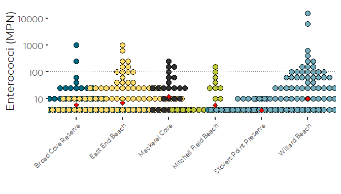
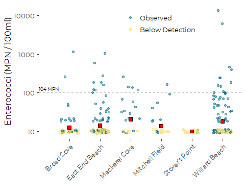
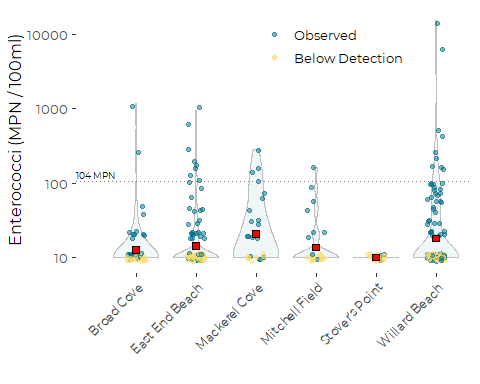
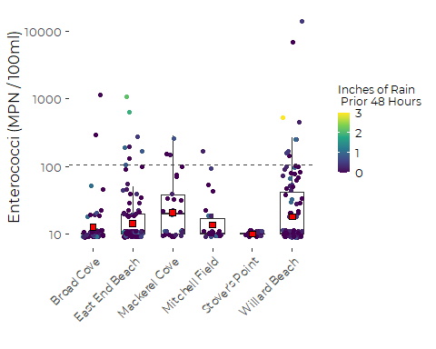
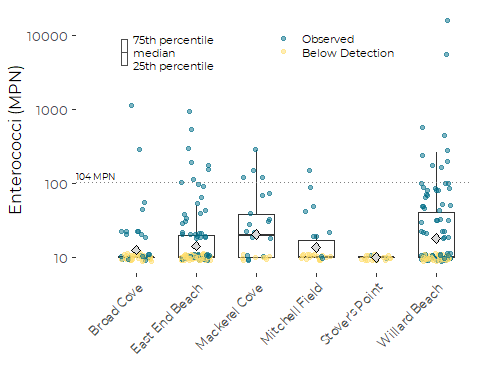
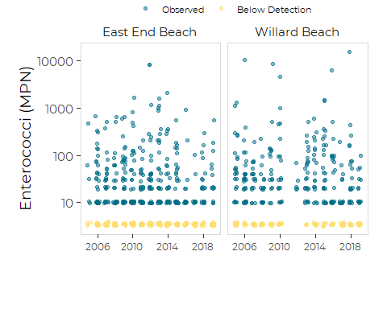

Graphics for Bacteria Levels at Casco Bay Beaches
================
Curtis C. Bohlen, Casco Bay Estuary Partnership.
01/23/2021

-   [Introduction](#introduction)
    -   [Handling non-detects](#handling-non-detects)
    -   [Standards](#standards)
        -   [Beaches Program](#beaches-program)
        -   [Maine State Class SB Waters
            Standards](#maine-state-class-sb-waters-standards)
-   [Import Libraries](#import-libraries)
-   [Data Preparation](#data-preparation)
    -   [Initial Folder References](#initial-folder-references)
    -   [Load Data](#load-data)
    -   [Add a “Beach” Identifier](#add-a-beach-identifier)
    -   [Simplify and Correct Beach
        Names](#simplify-and-correct-beach-names)
    -   [Add a “Day of the Week”
        Identifier](#add-a-day-of-the-week-identifier)
    -   [Add Maximum Likelihood Estimate for
        Non-detects](#add-maximum-likelihood-estimate-for-non-detects)
    -   [Calculate Exceedences](#calculate-exceedences)
-   [Recent Status](#recent-status)
    -   [Based on Non-detects at Reporting
        Limit](#based-on-non-detects-at-reporting-limit)
    -   [Based on Non-detects at Maximum Likelihood
        Estimator](#based-on-non-detects-at-maximum-likelihood-estimator)
-   [Create Geometric Mean Function](#create-geometric-mean-function)
-   [Plots of Recent Condition](#plots-of-recent-condition)
    -   [Dot Plot (Fails….)](#dot-plot-fails)
    -   [Jitter Plot](#jitter-plot)
        -   [Add Geometric Means](#add-geometric-means)
        -   [Add Annotations](#add-annotations)
    -   [Violin Plot with Jitter](#violin-plot-with-jitter)
        -   [Add Geometric Means](#add-geometric-means-1)
    -   [Boxplot with Jitter](#boxplot-with-jitter)
        -   [With Color by Rainfall](#with-color-by-rainfall)
        -   [With Color by Detection](#with-color-by-detection)
        -   [Add Annotation](#add-annotation)
        -   [Add Geometric Means](#add-geometric-means-2)
-   [Trend Graphics](#trend-graphics)


# Introduction

We present code for generating draft graphics for the “State of Casco
Bay” report, relating specifically to levels of bacteria observed at
swimming beaches.

The Beaches program monitors bacteria levels (currently) at six Casco
Bay beaches. Data is collected periodically (usually weekly) at each
beach, to inform beach managers and the public about possible risk of
swimming in water that may be polluted by certain pathogens.

The Beaches program measures “enterococci” bacteria, while DMR’s
shellfish program monitor’s “fedal coliform” bacteria. the two measures
are generally correlated, but are not directly comparable because of
different methods.

## Handling non-detects

**All graphics here treat non-detects as equal to the Reporting Limit!**

We generally prefer to replace non-detects with an estimate of what
“would have been observed” if the methods were more sensitive. One can
generate such estimates (more correctly, expected values of such
estimates) based on certain statistical assumptions. While those
assumptions can be called into question, such methods are usually
preferable to ignoring non-detects, assuming they represent “the value
of”true" measurements of zero, or making other *ad hoc* assumptions.

Unfortunately, we could not use statistical methods to correct for
non-detects with the data on bacteria levels at shellfish growing areas.
For technical reasons, some of the statistical methods we used to
analyze the shellfish data do not work with data that replaces
non-detects wit hmaximum likelihood estimates of the (expected value of)
the unobserved values.

For consistency in presentation in the State of Casco Bay Report, all
GRAPHICS for both Beaches and Shellfish bacteria data are presented
using the same conventions, including using data that treats non-detects
as equal to their detection limits. Because bacteria data are so skewed
and heavy tailed, this has only modest effect on many summary
statistics. However it does alter values of low quantiles and geometric
means.

Most statistical testing for the Beaches data are based on data that
replaces non-detects with maximum likelihood estimators of their
conditional means.

## Standards

### Beaches Program

104 CFU / 100 ml, for individual observations.

### Maine State Class SB Waters Standards

> the number of enterococcus bacteria in these waters may not exceed a
> geometric mean of 8 CFU per 100 milliliters in any 90-day interval or
> 54 CFU per 100 milliliters in more than 10% of the samples in any
> 90-day interval.

38 M.R.S. §465-B(2)(B)

# Import Libraries

``` r
library(fitdistrplus)
#> Loading required package: MASS
#> Loading required package: survival
library(tidyverse)
#> Warning: package 'tidyverse' was built under R version 4.0.5
#> -- Attaching packages --------------------------------------- tidyverse 1.3.1 --
#> v ggplot2 3.3.3     v purrr   0.3.4
#> v tibble  3.1.2     v dplyr   1.0.6
#> v tidyr   1.1.3     v stringr 1.4.0
#> v readr   1.4.0     v forcats 0.5.1
#> Warning: package 'tidyr' was built under R version 4.0.5
#> Warning: package 'dplyr' was built under R version 4.0.5
#> Warning: package 'forcats' was built under R version 4.0.5
#> -- Conflicts ------------------------------------------ tidyverse_conflicts() --
#> x dplyr::filter() masks stats::filter()
#> x dplyr::lag()    masks stats::lag()
#> x dplyr::select() masks MASS::select()

# library(GGally)

library(mgcv)      # For GAMs and GAMMs; used here for seasonal smoothers
#> Warning: package 'mgcv' was built under R version 4.0.5
#> Loading required package: nlme
#> 
#> Attaching package: 'nlme'
#> The following object is masked from 'package:dplyr':
#> 
#>     collapse
#> This is mgcv 1.8-35. For overview type 'help("mgcv-package")'.
library(emmeans)   # For marginal means

library(mblm)      # for the Thiel-Sen estimators

library(CBEPgraphics)
load_cbep_fonts()
theme_set(theme_cbep())

library(LCensMeans)
```

# Data Preparation

## Initial Folder References

``` r
sibfldnm    <- 'Derived_Data'
parent      <- dirname(getwd())
sibling     <- file.path(parent,sibfldnm)

dir.create(file.path(getwd(), 'figures'), showWarnings = FALSE)
#dir.create(file.path(getwd(), 'models'),  showWarnings = FALSE)
```

## Load Data

``` r
fn <- "beaches_data.csv"
beach_data <- read_csv(file.path(sibling, fn))
#> 
#> -- Column specification --------------------------------------------------------
#> cols(
#>   .default = col_double(),
#>   SiteCode = col_character(),
#>   sdatetime = col_datetime(format = ""),
#>   sdate = col_date(format = ""),
#>   Sample_ID = col_character(),
#>   Sample_Qualifier = col_character(),
#>   Lab_Qualifier = col_character(),
#>   Censored_Flag = col_logical(),
#>   Weather = col_character(),
#>   Past24HR_Weather = col_character(),
#>   Past48HR_Weather = col_character(),
#>   Tide_Stage = col_logical(),
#>   Water_Surface = col_character(),
#>   Current = col_logical()
#> )
#> i Use `spec()` for the full column specifications.
```

## Add a “Beach” Identifier

``` r
fn = "beach_locations.csv"
beach_lookup = read_csv(file.path(sibling, fn),
                        col_types = cols(
                          Town = col_character(),
                          Beach_Name = col_character(),
                          SamplePoint = col_character(),
                          Latitude = col_double(),
                          Longitude = col_double()
                        )) %>%
  select(-Latitude, -Longitude)

beach_data <- beach_data %>%
  mutate(Beach = beach_lookup$Beach_Name[match(SiteCode, 
                                               beach_lookup$SamplePoint)])
```

## Simplify and Correct Beach Names

``` r
beach_data <- beach_data %>%
  mutate(Beach = if_else(Beach == 'Stovers Point Preserve', "Stover's Point", Beach)) %>%
  mutate(Beach = if_else(Beach == 'Broad Cove Reserve', "Broad Cove", Beach)) %>%
  mutate(Beach = if_else(Beach == 'Mitchell Field Beach', "Mitchell Field", Beach))
```

## Add a “Day of the Week” Identifier

We need this to help evaluate whether samples are “normal” samples or
“storm” samples.

``` r
beach_data <- beach_data %>%
  mutate(Weekday = weekdays(sdate)) %>%
  relocate(Weekday, .after = Month)
```

## Add Maximum Likelihood Estimate for Non-detects

This uses our LCensMeans package, and estimates a maximum likelihood
estimate of the expected value of the (unobserved) left censored values.
It relies on several assumption that are questionable for these data,
but it is arguably better than using the detection limit or half the
detection limit.

Unfortunately, some of the more sophisticated models we run on the
shellfish data do not work with data transformed in this way. For
consistency, all GRAPHICS for both BEaches and Shellfish bacteria data
are presented showing data treating non-detects at the nominal detection
limit. For the BEaches data, most of the analyses were based on data
that substituted ML estimators for the non-detects.

``` r
beach_data <- beach_data %>%
  mutate(Bacteria2 = sub_cmeans(Bacteria, Censored_Flag) )
```

## Calculate Exceedences

``` r
beach_data <- beach_data %>%
  mutate(Exceeds = Bacteria > 104) %>%
  relocate(Exceeds, .after = Censored_Flag)
```

# Recent Status

## Based on Non-detects at Reporting Limit

``` r
recent_data <- beach_data %>%
  filter(Year > 2015)
```

``` r
recent_data %>%
  group_by(SiteCode) %>%
  summarize( years = length(unique(Year)),
             median_Bacteria = median(Bacteria, na.rm = TRUE),
             gmean_bacteria = exp(mean(log(Bacteria),nas.rm = TRUE)),
             mean_Bacteria = mean(Bacteria, na.rm = TRUE),
             n = sum(! is.na(Bacteria)),
             n_exceeds = sum(Exceeds, na.rm = TRUE),
             p_exceeds = n_exceeds / n)
#> # A tibble: 6 x 8
#>   SiteCode years median_Bacteria gmean_bacteria mean_Bacteria     n n_exceeds
#>   <chr>    <int>           <dbl>          <dbl>         <dbl> <int>     <int>
#> 1 BC-1         4              10           13.7          40.8    51         2
#> 2 EEB-01       4              10           16.0          39.4   103         8
#> 3 HARP-1       2              10           10            10      25         0
#> 4 HARP-2       2              10           14.7          22.7    26         1
#> 5 HARP-3       2              20           23.7          43.9    26         4
#> 6 WIL-02       4              10           21.9         246.    105         9
#> # ... with 1 more variable: p_exceeds <dbl>
```

## Based on Non-detects at Maximum Likelihood Estimator

Note that the geometric means, in particular, and some means, are
substantially lower.

``` r
recent_data %>%
  group_by(SiteCode) %>%
  summarize( years = length(unique(Year)),
             median_Bacteria = median(Bacteria2, na.rm = TRUE),
             gmean_bacteria = exp(mean(log(Bacteria2),nas.rm = TRUE)),
             mean_Bacteria = mean(Bacteria2, na.rm = TRUE),
             n = sum(! is.na(Bacteria2)),
             n_exceeds = sum(Exceeds, na.rm = TRUE),
             p_exceeds = n_exceeds / n)
#> # A tibble: 6 x 8
#>   SiteCode years median_Bacteria gmean_bacteria mean_Bacteria     n n_exceeds
#>   <chr>    <int>           <dbl>          <dbl>         <dbl> <int>     <int>
#> 1 BC-1         4            3.54           7.44         37.1     51         2
#> 2 EEB-01       4           10              9.42         36.1    103         8
#> 3 HARP-1       2            3.49           3.96          4.27    25         0
#> 4 HARP-2       2            3.51           7.34         18.4     26         1
#> 5 HARP-3       2           20             17.0          41.9     26         4
#> 6 WIL-02       4           10             14.9         244.     105         9
#> # ... with 1 more variable: p_exceeds <dbl>
```

Note that the median Bacteria for pretty much all of these stations is
at or below the lower detection limit. (That is possible because we have
replaced non-detects by an estimate of the conditional mean expected for
unobserved censored values). That means the data is at or below the
detection limits more than 50% of the time.

``` r
cat('\nNon-detects at Detection Limit\n')
#> 
#> Non-detects at Detection Limit
summary(recent_data$Bacteria)
#>    Min. 1st Qu.  Median    Mean 3rd Qu.    Max. 
#>    10.0    10.0    10.0   101.1    20.0 15531.0
cat('\nNon-detects at maximum likelihood estimator\n')
#> 
#> Non-detects at maximum likelihood estimator
summary(recent_data$Bacteria2)
#>      Min.   1st Qu.    Median      Mean   3rd Qu.      Max. 
#>     3.166     3.441    10.000    97.865    20.000 15531.000
cat('\nGeometric Mean\n')
#> 
#> Geometric Mean
exp(mean(log(recent_data$Bacteria2)))
#> [1] 10.0894
cat('\n\nProbability of Violating Standard\n')
#> 
#> 
#> Probability of Violating Standard
sum(recent_data$Exceeds) / sum(! is.na(recent_data$Exceeds))
#> [1] 0.07142857
```

# Create Geometric Mean Function

``` r
gm_mean <- function(x) {
  exp(mean(log(x)))
}
```

# Plots of Recent Condition

## Dot Plot (Fails….)

``` r
recent_data %>%
  ggplot(aes(x = Beach, y = Bacteria, fill = Beach)) +
  geom_dotplot(binaxis = "y", 
               stackdir = "centerwhole", 
               position = "dodge",
               binpositions = 'all',
               method = 'histodot',
               stroke = 0,
               binwidth = .2) +
  stat_summary(fun = gm_mean, fill = 'red', shape = 23) +
  
  geom_hline(yintercept = 104, color = 'gray25', lty = 2) +
  
  scale_y_log10() +
  scale_fill_manual(values = cbep_colors()) +

    theme(axis.text.x = element_text(angle = 45, size = 9, hjust = 1),
        legend.position = 'none') +

  ylab('Enterococci (MPN / 100ml)') +
  xlab('') 
#> Warning: Removed 6 rows containing missing values (geom_segment).
```



``` r
  #geom_bar(data = plain_emms, mapping = aes(Beach, response))
```

## Jitter Plot

``` r
jitter_plt <- recent_data %>%
  ggplot(aes(x = Beach, y = Bacteria)) +
  
  geom_jitter(aes(color = Censored_Flag),
              width = 0.3, 
              height = .05,
              alpha = 0.5) +
  
  scale_y_log10() +
  scale_color_manual(values = cbep_colors(), 
                     name = '', labels = c('Observed', 'Below Detection')) +
  
  theme_cbep(base_size = 12) +

  theme(axis.text.x = element_text(angle = 45, size = 9, hjust = 1)) +
  theme(legend.position = c(.6, .9)) +
  
  guides(color = guide_legend(override.aes = list(alpha = c(0.5,0.751) ) )) +

  ylab('Enterococci (MPN / 100ml)') +
  xlab('')
```

### Add Geometric Means

This looks like the geometric means annotation are not properly lined
up, but it is lined up better in the PDF version, which is what counts.

``` r
xanchor <- 3.75
yanchor <- 2200

jitter_plt <- jitter_plt + 
  stat_summary(fun = gm_mean, fill = 'red',shape = 22) 
  
  # annotate('point', x= xanchor, y = yanchor,
  #           size = 3, pch = 22, fill = 'red') +
  # annotate('text', x= xanchor + 0.25, y = yanchor,
  #          hjust = 0, size = 3.5, label = 'Geometric Mean')
```

### Add Annotations

``` r
jitter_plt +
  geom_hline(yintercept = 104, color = 'gray25', lty = 2) +
  #geom_hline(yintercept = 8, color = 'gray25', lty = 2) +
  
  annotate('text', x = 0, y  = 130, label = '104 MPN', size = 2.5, hjust = 0) +
  #annotate('text', x = 0, y = 6, label = 'Chronic = 8', size = 2.5, hjust = 0) 

ggsave('figures/recent_conditons_jitter.pdf', device = cairo_pdf, 
       width = 5, height = 4)
#> Warning: Removed 6 rows containing missing values (geom_segment).

#> Warning: Removed 6 rows containing missing values (geom_segment).
```



## Violin Plot with Jitter

The challenge here is that if we make width proportional to number of
observations, the large number of observations and non-detect at
Stover’s Point dominates. So we make all sites equal width , and show
dots to signal sample size.

``` r
violin_plt <- recent_data %>%
  ggplot(aes(x = Beach, y = Bacteria)) +
  geom_violin(scale = 'width',
              width = .75,
              # draw_quantiles = c(0.25, 0.5, 0.75),
              fill = cbep_colors()[6],
              color = 'gray75',
              alpha = 0.1) +
  geom_jitter(aes(color = Censored_Flag),
              width = 0.15, 
              height = .05,
              alpha = 0.5) +
  
  geom_hline(yintercept = 104, color = 'gray25', lty = 2) +
  annotate('text', x = 0, y  = 130, label = '104 MPN', size = 2.5, hjust = 0) +
  
  scale_y_log10() +
  scale_color_manual(values = cbep_colors(), 
                     name = '', labels = c('Observed', 'Below Detection')) +
  
  theme_cbep(base_size = 12) +

  theme(axis.text.x = element_text(angle = 45, size = 9, hjust = 1)) +
  theme(legend.position = c(.65, .9)) +

  guides(color = guide_legend(override.aes = list(alpha = c(0.5,0.75) ) )) +

  ylab('Enterococci (MPN / 100ml)') +
  xlab('')
```

### Add Geometric Means

``` r
xanchor <- 3.5
yanchor <- 1500

violin_plt + 
  stat_summary(fun = gm_mean, fill = 'red',shape = 22) 
#> Warning: Removed 6 rows containing missing values (geom_segment).
```



``` r
  
  # annotate('point', x= xanchor, y = yanchor,
  #           size = 3, pch = 22, fill = 'red') +
  # annotate('text', x= xanchor + 0.3, y = yanchor,
  #          hjust = 0, size = 3.5, label = 'Geometric Mean')

ggsave('figures/recent_conditons_jitter_violin.pdf', device = cairo_pdf, 
       width = 5, height = 4)
#> Warning: Removed 6 rows containing missing values (geom_segment).
```

## Boxplot with Jitter

### With Color by Rainfall

``` r
recent_data %>%
  ggplot(aes(x = Beach, y = Bacteria)) +
  geom_boxplot(width = .6, outlier.shape = NA) +
  geom_jitter(aes(color = Rain48), width = 0.25, 
              height = .05, 
              alpha = 1) +
  
  geom_hline(yintercept = 104, color = 'gray25', lty = 2) +
  #geom_hline(yintercept = 8, color = 'gray25', lty = 2) +
  
  scale_y_log10() +
  
  scale_color_viridis_c('Inches of Rain\n Prior 48 Hours') +
  
  theme_cbep(base_size = 12) +

  theme(legend.key.size = unit(10, 'points'),
        legend.title = element_text(size = 9)) +
  
  theme(axis.text.x = element_text(angle = 45, size = 9, hjust = 1)) +

  ylab('Enterococci (MPN / 100ml)') +
  xlab('') +
  stat_summary(fun = gm_mean, fill = 'red',shape = 22)
#> Warning: Removed 6 rows containing missing values (geom_segment).
```



### With Color by Detection

``` r
plt <- recent_data %>%
  ggplot(aes(x = Beach, y = Bacteria)) +
  geom_boxplot(width = .6, outlier.shape = NA) +
  geom_jitter(aes(color = Censored_Flag),
              width = 0.25, 
              height = .05, 
              #color = cbep_colors()[5],
              alpha = 0.5) +
  
  geom_hline(yintercept = 104, color = 'gray25', lty = 2) +
  annotate('text', x = 0, y  = 130, label = '104 MPN', size = 2.5, hjust = 0) +
  
  scale_y_log10() +
  
  scale_color_manual(values = cbep_colors(), 
                     labels = c('Observed', 'Below Detection'),
                     name = NULL) +
  
  theme_cbep(base_size = 12) +

  theme(axis.text.x = element_text(angle = 45, size = 9, hjust = 1)) +
  theme(legend.position = c(.65, .875),
        legend.text = element_text(size = 8),
        legend.key.height = unit(10, 'points')) +

  ylab('Enterococci (MPN / 100ml)') +
  xlab('')
```

### Add Annotation

``` r
# Calculate positions for annotations
xanchor <- 0.75

# On a log scale, equally spaced items have the same RATIO
yanchor <- 6000
ylow    <-  2/3*yanchor
yhigh    <-  3/2* yanchor

plt2 <- plt + 
  annotate('rect', xmin = xanchor, ymin = ylow, xmax =xanchor + 0.1, ymax = yhigh,
           fill = 'white', color = 'gray30', size = .5) + 
  annotate('segment', x= xanchor, y = yanchor, xend = xanchor + 0.1, yend = yanchor, 
           color = 'gray30') +

  annotate('text', x= xanchor + 0.2, y = ylow,
           hjust = 0, size = 3, label = '25th percentile') +
  annotate('text', x= xanchor + 0.2, y = yanchor,
           hjust = 0, size = 3, label = 'median') +
  annotate('text', x= xanchor + 0.2, y = yhigh,
           hjust = 0, size = 3, label = '75th percentile')
```

### Add Geometric Means

``` r
plt2 + 
   stat_summary(fun = gm_mean, shape = 23, fill = 'gray85') +

# annotate('point', x= xanchor, y = yanchor * (4/9),
#             size = 3, pch = 22, fill = 'red') +
# annotate('text', x= xanchor + 0.2, y = yanchor * (4/9),
#            hjust = 0, size = 3, label = 'geometric mean')

ggsave('figures/recent_conditons_jitter_box.pdf', device = cairo_pdf, 
       width = 5, height = 4)
#> Warning: Removed 6 rows containing missing values (geom_segment).

#> Warning: Removed 6 rows containing missing values (geom_segment).
```



# Trend Graphics

We only have long term data from two beaches – East End and Willard. And
trends are not statistically significant at eh single beach level.
Apparent importance depends on the model uses, which is always
uncomfortable.

For simplicity, we restrict attention to those to near-continuous
records only.

``` r
trend_data <- beach_data %>%
  filter(SiteCode == 'WIL-02' | SiteCode == 'EEB-01') %>%
  filter(! is.na(Bacteria)) %>%
  filter(Year > 2004) %>%
  filter(Reporting_Limit > 5 | is.na(Reporting_Limit))
```

``` r
plt <- ggplot(trend_data, aes(x = Year, y = Bacteria, color = Censored_Flag)) +
  geom_jitter(alpha = .5, height = 0.025, width = 0.2) +
  scale_y_log10() +
  scale_x_continuous(breaks = c(2006, 2010, 2014, 2018)) +
  
  xlab('') +
  ylab('Enterococci (MPN / 100ml)') +
  
  theme_cbep(base_size = 14) +
  theme(panel.border = element_rect(color = 'gray85', fill = NA)) + 

  scale_color_manual(values = cbep_colors(), 
                     labels = c('Observed', 'Below Detection'),
                     name = NULL,
                     guide = guide_legend(ncol  = 2)) +
  # Following adds a little extra space above the plot to make room
  # for a legend, and places the legend a bit closer to the plot
  # than the default "top" position.
  
  theme( plot.margin=unit(c(.25,.25,.5,.25),"inch"),
         legend.position = c(.5,1.2),
         legend.text = element_text(size = 8),
         legend.key.height = unit(10, 'points')) +

  theme(axis.text.x = element_text(size = 9)) +
  facet_wrap(~Beach, nrow = 1)

plt
```



``` r
ggsave('figures/trend_two_beaches.pdf', device = cairo_pdf, 
       width = 5, height = 4)
```
